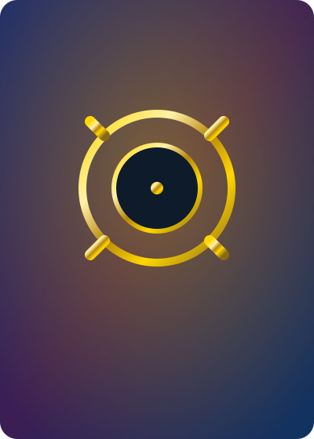
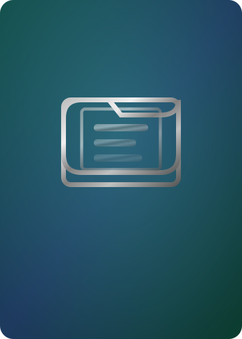
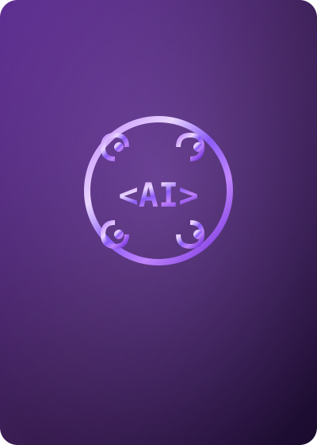
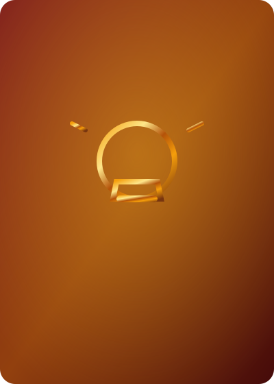

# 🧠 LLM Wiki

> 개인 지식 베이스. 손에 쥔 카드처럼 펼쳐진 카드를 탐색해보세요.
> **호버** = 살짝 올라옴 · **클릭 1번** = 확대+마우스 따라 기울임 · **클릭 2번** = 페이지 이동

  

    

      

        
        

      

      
⚙️ 링 스택

      

        Unity
        게임
      

    

    
720슬롯 AND 판정 · 절차적 메시 · NPR 셰이더

  

  

    

      

        
        

      

      
📁 모든 프로젝트

      

        전체
        보기
      

    

    
프로젝트 도메인 전체 목록과 하위 구조 탐색

  

  

    

      

        
        

      

      
🤖 LLM 사용로그

      

        기록
        Log
      

    

    
날짜별 LLM 사용 기록 · append-only

  

  

    

      

        
        

      

      
💡 프롬프트 패턴

      

        기법
        Prompt
      

    

    
유용한 프롬프트/기법 모음

  

