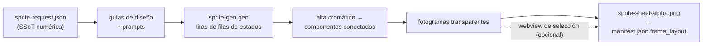

<h1 align="center">sprite-gen</h1>

<p align="center"><b>Entra un dibujo. Sale un atlas de sprites listo para el juego, respirando.</b></p>

<p align="center">

**Inglés** · [한국어](README.ko.md) · [日本語](README.ja.md) · [简体中文](README.zh-Hans.md) · [Español](README.es.md) · [Français](README.fr.md)

</p>

---

## Respiración

Una pose estática de reposo parece congelada. **Breathe** convierte una sola pose en un bucle vivo mediante una deformación determinista de compresión y estiramiento aplicada sobre tus fotogramas seleccionados. Sin regeneración, sin volver a extraer y sin arte adicional. Basta con un campo en el archivo auxiliar:

```json
"breathe": { "depth": 0.05, "breaths": 3 }
```

- **Consciente de la anatomía.** El motor mide la silueta: el estrechamiento del cuello, el par de ojos simétrico en figuras amorfas sin cuello y la anchura del torso frente a la de los apéndices. Las cabezas permanecen **idénticas bit a bit** en todos los fotogramas; las alas y los brazos se desplazan, nunca se estiran.
- **Fiel al píxel.** Solo se usan correspondencias de filas y columnas enteras: cada fotograma de salida sigue siendo pixel art limpio sobre la misma cuadrícula. Un contorno de 1 px sigue siendo un contorno de 1 px: la deformación conserva los bordes de la silueta y normaliza la duplicación en escalera, anclándose en la línea interior.
- **Una regla que puedes agarrar.** Arrastra el límite rígido (rojo), el eje del cuerpo (azul) y la anchura del torso (línea discontinua) directamente sobre la reproducción en vivo. Al soltar, el servidor vuelve a calcular la anatomía, mientras la vista previa sigue respirando durante el cálculo.
- **Vista previa idéntica byte a byte.** El espejo de la webview y la generación en Python producen los mismos bytes, algo garantizado mediante pruebas doradas. El bucle que ves es exactamente el que se publica en el atlas.

<p align="center">
  
</p>

El mismo horneado determinista se aplica a vistas frontales, laterales y traseras de cualquier silueta, incluidos humanoides, masas y tentáculos.

Pídele a un modelo de imágenes una «hoja de sprites» y ya sabes qué obtendrás: un personaje cuyo rostro cambia en cada fotograma, un fondo que no se puede eliminar por clave de color, poses que se solapan y se desvían de la cuadrícula, y un PNG que tu motor de juego ni siquiera puede usar. Una demostración bonita, un recurso inútil.

`sprite-gen` es una habilidad para Codex/Claude que cierra esa brecha. Dale **una imagen base** y una lista de acciones: genera fila por fila, fija la identidad del personaje, elimina el fondo cromático para obtener un canal alfa real, extrae cada pose como un fotograma transparente y limpio, y genera un atlas para ejecución **con un `manifest.json.frame_layout` legible por máquina**.

Y para ese último 10 % que la generación nunca resuelve bien, existe una **webview de selección**: compara fotogramas en paralelo, descarta los defectuosos, ajusta la rotación, la escala y la posición de forma no destructiva, y observa el bucle en vivo antes de generar el resultado. La canalización se encarga del trabajo; tú aportas el criterio.

```text
sprite-request.json → guías de diseño + prompts → filas de estados de sprite-gen gen
→ alfa cromático → componentes conectados → fotogramas transparentes
→ sprite-sheet-alpha.png + manifest.json.frame_layout
```



> Arquitectura completa: [`docs/architecture.md`](docs/architecture.md)

## Lo que realmente obtienes

- **Un atlas de sprites transparente** (`sprite-sheet-alpha.png`): alfa real, sin restos de halos cromáticos y verificado sobre fondos blancos.
- **Un manifiesto para ejecución** (`manifest.json.frame_layout`): rectángulos absolutos de los fotogramas, fps por estado e indicadores de bucle. Tu motor muestrea rectángulos; nunca tiene que adivinar una cuadrícula.
- **Variantes de color deterministas**: `sprite-gen recolor` toma la hoja base y un mapa de paleta, y genera N hojas variantes con un solo comando (coincidencia RGB exacta de forma predeterminada; la misma entrada produce los mismos bytes de salida). La webview de selección permite compararlas mediante parpadeo y registra el nombre adoptado. Detalles: [`docs/recolor.md`](docs/recolor.md).
- **Control de calidad que puedes observar**: GIF y hojas de contacto por estado, para evaluar el movimiento como movimiento antes de publicar nada.
- **Etiquetas honestas**: las acciones breves y legibles (reposo, salto, ataque, saludo) constituyen la ruta estable; la locomoción cíclica (caminar/correr) se marca como experimental salvo que supere realmente el control de calidad de movimiento. Sin promesas exageradas ocultas.

## Calidad del alfa cromático

El extractor mantiene determinista la limpieza cromática: la separación mediante alfa suave conserva los mechones de cabello con antialiasing y los contornos finos, en lugar de arrancarlos antes de poder calcular la cobertura.

<p align="center">
  <br />
  <em>Ilustración, clave magenta: fuente, eliminación de v1.12.0 y separación mediante alfa suave de v1.13.0.</em>
</p>

<p align="center">
  <br />
  <em>Ilustración, clave verde: fuente, eliminación de v1.12.0 y separación mediante alfa suave de v1.13.0.</em>
</p>

<p align="center">
  <br />
  <em>Pixel art, clave magenta: fuente, eliminación de v1.12.0 y salida binarizada de v1.13.0.</em>
</p>

<p align="center">
  <br />
  <em>Pixel art, clave verde: fuente, eliminación de v1.12.0 y salida binarizada de v1.13.0.</em>
</p>

Los recortes ampliados que aparecen a continuación muestran el detalle de los bordes de las comparaciones de cuerpo completo.


## Backbone Lattice

El «pixel art» generado por IA no es pixel art. Los bloques oscilan, los bordes contienen antialiasing y la retícula se desplaza dentro de una misma fila, por lo que cortar sobre una cuadrícula uniforme mezcla un bloque con el siguiente. La solución de la comunidad consiste en «desfalsear» la imagen: estimar el tamaño de los bloques a partir de la longitud de los segmentos y volver a cuantizar. Sin embargo, esto mide cada fotograma por separado, por lo que el tamaño de las celdas de un ciclo de marcha se expande y contrae de un fotograma a otro.

**Backbone Lattice** mide una única cuadrícula para todo el sujeto y ajusta cada corte a ella. La detección del paso por fotograma alimenta un consenso de toda la fila y entre fotogramas que descarta las detecciones armónicas erróneas; esa cuadrícula de consenso es la *columna vertebral* a la que se ajusta cada corte. Los cortes caen sobre límites de color reales, y una anchura mínima de celda proporcional al paso medido evita que dos cortes vecinos lleguen a colapsar sobre la misma banda. Una única columna vertebral hace que un bloque conserve el mismo tamaño durante toda la animación, en lugar de saltar entre fotogramas.

El resultado se verifica contra lo que se publica, no mediante una inspección visual de un fotograma elegido a mano: cada ejecución de corrección de píxeles vuelve a derivarse de su propia tira de origen y se compara píxel por píxel. La forma que aprobaste sigue siendo la que obtienes; lo único que cambia es dónde se colocan los contornos y el sombreado, que es precisamente lo que decide la columna vertebral.

## Webview de selección

La generación te lleva al 90 %. La webview es donde una persona completa el trabajo hasta dejarlo *listo para publicar*: es independiente, no depende de Studio ni de ningún framework y se ejecuta en cualquier lugar donde esté instalada la habilidad (Claude Code Desktop, la aplicación Codex o una terminal convencional).


- **Dos filas por estado:** la **secuencia de reproducción** arriba y un **grupo de candidatos** debajo (por ejemplo, una segunda o tercera generación). Arrastra el control ⠿ de un fotograma para reordenar la secuencia, o sube un recorte desde el grupo para reconstruir un bucle de carrera limpio con los mejores fotogramas de distintas generaciones. La disposición se guarda, por lo que se restaura al volver a abrirla.
- **Transformación no destructiva** por fotograma: arrastrar = mover, rueda = escalar, control superior = rotar, control inferior izquierdo = sesgar, además de un interruptor de volteo horizontal para salidas invertidas de izquierda a derecha. Las ediciones se guardan en un archivo auxiliar `curation.json`: los PNG de origen nunca se reescriben y el paso de composición genera el resultado de forma determinista. La vista previa y la generación comparten una única matriz afín, por lo que lo que alineas es lo que obtienes.
- La **vista previa en vivo** anima la secuencia a los fps del estado, con reproducción/pausa, avance fotograma a fotograma y control de velocidad de 0.25× a 4×.
- No sirve solo para sprites: haz que apunte a cualquier carpeta de imágenes candidatas (iconos, logotipos o borradores generados) mediante `unpack_atlas_run.py --pngs-dir` y úsala como una vista general para elegir la mejor opción.

### Cuadrícula de suelo isométrica

Para conjuntos isométricos, la webview superpone la cuadrícula del suelo (obtenida de los campos de mosaico/anclaje de `meta.json`) para que puedas ajustar los muebles a los ejes del rombo mediante el control de sesgo.


### Idiomas

La webview incluye inglés y coreano. Pasa `--lang en|ko` al iniciarla o utiliza el selector integrado:

```bash
python3 scripts/serve_curation.py --run-dir <run-dir> --lang en   # o ko
```

## Compatibilidad con Python

`sprite-gen` es compatible con CPython 3.10 o posterior. La integración continua ejecuta la versión mínima compatible (3.10) y la última versión cubierta (3.14) en ejecutores alojados en GitHub.

El inicio rápido requiere una instalación de Python con `venv`/`ensurepip` funcionales. Si `python3 -m venv` falla antes de instalar paquetes en una distribución local, utiliza una compilación estándar de CPython de cualquier versión compatible y vuelve a ejecutar los mismos comandos.

## Inicio rápido

```bash
# 0. instalar las dependencias (Pillow, NumPy) en un entorno virtual nuevo
python3 -m venv .venv && source .venv/bin/activate
pip install -e .

# 1. preparar una ejecución a partir de una imagen base
python3 scripts/prepare_sprite_run.py --out-dir <run-dir> --character-id <id> --base-image base.png

# 2. generar una imagen de fila por estado con la CLI del proveedor controlada por el motor
python3 scripts/generate_sprite_image.py --provider codex \
  --prompt-file <run-dir>/prompts/<state>.txt \
  --out <run-dir>/raw/<state>.png \
  --ref <run-dir>/base-source.png \
  --ref <run-dir>/references/layout-guides/<state>.png
# 3. extraer los fotogramas
python3 scripts/extract_sprite_row_frames.py --run-dir <run-dir>

# 4. (opcional) seleccionar los fotogramas en la webview
python3 scripts/serve_curation.py --run-dir <run-dir>

# 5. generar el atlas para ejecución
python3 scripts/compose_sprite_atlas.py --run-dir <run-dir>
```

### Editar una hoja terminada

Cuando solo se conserva la hoja combinada, reconstruye un directorio de ejecución preparado para el selector y, a continuación, selecciona y exporta:

```bash
# reconstruir fotogramas: --grid explícito, rectángulos de --manifest o detección alfa automática (predeterminada)
python3 scripts/unpack_atlas_run.py --atlas sheet.png            # detección automática
python3 scripts/unpack_atlas_run.py --manifest manifest.json     # rectángulos exactos
python3 scripts/unpack_atlas_run.py --pngs-dir furniture/        # importar un conjunto de PNG independientes

# después de la selección, aplicar las correcciones a los PNG con nombre
python3 scripts/export_curated_pngs.py --run-dir <run-dir>
```

La salida se guarda de forma predeterminada en una carpeta localizable `<source>-curator` junto a la entrada.

### Generación de variantes de color de una hoja terminada

Una vez compuesto el atlas, sustituye los colores seleccionados para obtener N hojas terminadas sin volver a ejecutar la generación. El arte de píxeles utiliza coincidencia exacta de forma predeterminada; el arte con bordes suaves puede habilitar una tolerancia. La geometría y el alfa nunca cambian: el manifiesto base describe cada variante.

```bash
# bosqueja los colores opacos (edítalo para convertirlo en una especificación de recoloreado con kind "sprite-gen-recolor")
python3 -m sprite_gen.cli recolor-palette --base <run-dir>/sprite-sheet-alpha.png --out palette.draft.json

# genera cada variante de color en <run-dir>/variants/
python3 -m sprite_gen.cli recolor --run-dir <run-dir> --spec recolor.spec.json

# compara mediante parpadeo y adopta en la vista de curación
python3 -m sprite_gen.cli curation --run-dir <run-dir>
```

Contrato completo de especificación/informe y campo del sidecar de adopción: [`docs/recolor.md`](docs/recolor.md).

### Eliminación del fondo de una imagen importada

Los sprites generados se recortan a partir de su propio fondo magenta/verde dentro del pipeline, por lo que nunca necesitan esto. `cutout` es la utilidad de importación/posedición: una imagen que llegó *con* un fondo uniforme opaco (un icono dibujado a mano, un sprite descargado, una captura de pantalla) se convierte en un PNG transparente limpio.

<p align="center">
  
</p>

```bash
# enruta según el color de la esquina: blanco/marfil -> matte, magenta/verde -> motor de extracción
python3 -m sprite_gen.cli cutout icon.png --white-check
```

Lee el color de fondo de la esquina y enruta (`--key auto|white|magenta|green`):

- **blanco / marfil / sólido** → matte posicional. Un relleno por inundación desde una esquina conserva únicamente el fondo conectado (los reflejos brillantes *dentro* del objeto sobreviven, sin crear agujeros) y, a continuación, un alfa suave descontaminado difumina el borde. Ajústalo con `--strength` (eliminación del bisel), `--band` (profundidad del borde) y `--erode`.
- **clave magenta / verde** → se reutiliza sin cambios el motor cromático `extract` verificado del proyecto. Los colores clave nunca aparecen en los objetos, por lo que allí su recorte basado únicamente en el color es seguro, exactamente donde *no* se necesita la protección del relleno por inundación de un matte blanco.

`--white-check` genera composiciones cian/magenta/amarillo para que cualquier halo restante destaque claramente. Está pensado para fondos uniformes, no para fondos complejos o no uniformes.

El flujo de trabajo completo orientado a agentes y sus contratos se encuentran en [`SKILL.md`](SKILL.md).

## Instalación

Desde los flujos de trabajo del instalador de skills de Codex, instala este repositorio como skill raíz:

```bash
python3 ~/.codex/skills/.system/skill-installer/scripts/install-skill-from-github.py \
  --repo aldegad/sprite-gen --path .
```

### Propiedad de la generación de imágenes

La generación respaldada por proveedores forma parte de este motor (`sprite_gen.gen`), con `codex` y `grok` como proveedores compatibles. La skill general `image-gen` es solo un puente ligero hacia el mismo comando, por lo que no necesita una segunda implementación de proveedor. Consulta [`docs/gen.md`](docs/gen.md) para conocer el contrato de la CLI y de verificación.

## Atribución

El flujo de trabajo por filas de componentes está inspirado en la skill `hatch-pet`, licenciada bajo Apache-2.0, pero está dirigido a atlas genéricos de sprites para juegos y no incluye paquetes de mascotas ni recursos visuales de mascotas.

## Licencia

Apache-2.0
