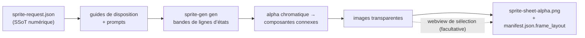

<h1 align="center">sprite-gen</h1>

<p align="center"><b>Un dessin en entrée. Un atlas de sprites prêt pour le jeu en sortie — et qui respire.</b></p>

<p align="center">

**Anglais** · [한국어](README.ko.md) · [日本語](README.ja.md) · [简体中文](README.zh-Hans.md) · [Español](README.es.md) · [Français](README.fr.md)

</p>

---

## Respiration

Une pose de repos immobile paraît figée. **Breathe** transforme une pose unique en une boucle vivante — un effet déterministe d’écrasement et d’étirement appliqué par-dessus vos images soigneusement sélectionnées. Aucune nouvelle génération, aucune nouvelle extraction, aucune ressource graphique supplémentaire. Un seul champ annexe :

```json
"breathe": { "depth": 0.05, "breaths": 3 }
```

- **Conscient de l’anatomie.** Le moteur mesure la silhouette : étranglement du cou, paire d’yeux symétrique sur les formes sans cou, largeur du torse par rapport aux appendices. Les têtes restent **strictement identiques au niveau des bits** sur toutes les images ; les ailes et les bras sont déplacés, jamais étirés.
- **Fidèle aux pixels.** Uniquement une correspondance entière des lignes et des colonnes — chaque image produite reste un pixel art net sur la même grille. Un contour de 1 px reste un contour de 1 px : la déformation préserve les bords de la silhouette et normalise le doublement en escalier, avec un ancrage sur la ligne intérieure.
- **Une règle que vous pouvez saisir.** Faites glisser directement sur la lecture en direct la limite rigide (rouge), l’axe du corps (bleu) et la largeur du torse (pointillés). Le serveur recalcule l’anatomie au relâchement — et l’aperçu continue de respirer pendant le recalcul.
- **Aperçu identique octet pour octet.** Le miroir de la webview et la génération Python produisent les mêmes octets, ce que garantissent des tests de référence. La boucle que vous regardez est exactement celle qui est livrée dans l’atlas.

<p align="center">
  
</p>

Le même traitement déterministe s’applique aux vues de face, de profil et de dos de toute silhouette, y compris les humanoïdes, les formes amorphes et les tentacules.

Demandez une « sprite sheet » à un modèle d’image et vous savez ce que vous obtiendrez : un personnage dont le visage change à chaque image, un arrière-plan impossible à détourer proprement, des poses qui se chevauchent et dérivent hors de la grille, ainsi qu’un PNG que votre moteur de jeu ne peut pas réellement exploiter. Une jolie démo, mais une ressource inutilisable.

`sprite-gen` est une compétence Codex/Claude qui comble cette lacune. Fournissez-lui **une image de base** et une liste d’actions : elle pilote la génération ligne par ligne, verrouille l’identité du personnage, remplace l’arrière-plan chromatique par une véritable transparence alpha, extrait chaque pose sous forme d’image transparente propre et génère un atlas d’exécution **avec un `manifest.json.frame_layout` lisible par machine**.

Et pour les 10 % restants que la génération ne réussit jamais parfaitement, une **webview de sélection** permet de comparer les images côte à côte, de rejeter celles qui sont défectueuses, d’ajuster de manière non destructive la rotation, l’échelle et la position, puis d’observer la boucle en direct avant la génération finale. Le pipeline effectue le travail ; vous gardez la maîtrise artistique.

```text
sprite-request.json → guides de disposition + prompts → lignes d’états sprite-gen gen
→ alpha chromatique → composantes connexes → images transparentes
→ sprite-sheet-alpha.png + manifest.json.frame_layout
```



> Architecture complète : [`docs/architecture.md`](docs/architecture.md)

## Ce que vous obtenez réellement

- **Un atlas de sprites transparent** (`sprite-sheet-alpha.png`) — véritable transparence alpha, sans frange chromatique résiduelle, vérifié sur des arrière-plans blancs.
- **Un manifeste d’exécution** (`manifest.json.frame_layout`) — rectangles absolus des images, fréquence d’images et indicateurs de boucle pour chaque état. Votre moteur échantillonne des rectangles ; il ne tente jamais de deviner une grille.
- **Des palettes de couleurs déterministes** — `sprite-gen recolor` utilise la feuille de base et une table de correspondance de palette pour générer N feuilles variantes en une seule commande (correspondance RVB exacte par défaut ; mêmes données en entrée, mêmes octets en sortie). La webview de sélection les compare par clignotement et enregistre le nom retenu. Détails : [`docs/recolor.md`](docs/recolor.md).
- **Une assurance qualité observable** — des GIF par état et des planches-contact permettent d’évaluer le mouvement comme un mouvement avant toute livraison.
- **Des libellés honnêtes** — les actions courtes et lisibles (repos, saut, attaque, salut) constituent le parcours stable ; la locomotion cyclique (marche/course) est signalée comme expérimentale, sauf si le contrôle qualité du mouvement est effectivement réussi. Aucune promesse excessive passée sous silence.

## Qualité de l’alpha chromatique

L’extracteur assure un nettoyage chromatique déterministe : le démélange avec alpha progressif préserve les mèches de cheveux anticrénelées et les contours fins au lieu de les retirer avant que la couverture puisse être calculée.

<p align="center">
  <br />
  <em>Illustration, fond d’incrustation magenta : source, détourage v1.12.0, démélange avec alpha progressif v1.13.0.</em>
</p>

<p align="center">
  <br />
  <em>Illustration, fond d’incrustation vert : source, détourage v1.12.0, démélange avec alpha progressif v1.13.0.</em>
</p>

<p align="center">
  <br />
  <em>Pixel art, fond d’incrustation magenta : source, détourage v1.12.0, sortie binarisée v1.13.0.</em>
</p>

<p align="center">
  <br />
  <em>Pixel art, fond d’incrustation vert : source, détourage v1.12.0, sortie binarisée v1.13.0.</em>
</p>

Les recadrages rapprochés ci-dessous montrent les détails des bords à l’origine des comparaisons en pied.


## Backbone Lattice

Le « pixel art » généré par l’IA n’est pas du pixel art. Les blocs vacillent, les bords comportent de l’anticrénelage et la grille dérive au sein d’une même ligne, si bien qu’une découpe sur une grille régulière étale un bloc sur le suivant. La solution communautaire consiste à « défalsifier » l’image — estimer la taille des blocs à partir de la longueur des segments et effectuer une nouvelle quantification — mais chaque image est alors mesurée indépendamment, ce qui fait varier la taille des cellules d’une image à l’autre dans un cycle de marche.

**Backbone Lattice** mesure une grille unique pour l’ensemble du sujet et y contraint chaque découpe. La détection du pas pour chaque image alimente un consensus couvrant toute la ligne et toutes les images, capable de l’emporter sur les détections harmoniques erronées ; cette grille consensuelle constitue l’*ossature* sur laquelle s’aligne chaque découpe. Les découpes tombent sur les véritables limites de couleur, et une largeur de cellule minimale proportionnelle au pas mesuré empêche deux découpes voisines de se rabattre sur la même bande. Une seule ossature permet ainsi à un même bloc de conserver la même taille pendant toute une animation au lieu de sauter d’une image à l’autre.

Le résultat est vérifié par rapport à ce qui est effectivement livré, et non évalué à l’œil sur une image soigneusement choisie : chaque exécution de défalsification des pixels est recalculée depuis sa propre bande source, puis comparée pixel par pixel. La forme que vous avez approuvée reste celle que vous obtenez ; seules les positions des contours et des ombrages changent, ce qui correspond précisément à la décision prise par l’ossature.

## Webview de sélection

La génération vous amène à 90 %. La webview permet à une personne de parvenir à une ressource *prête à être livrée* — elle est autonome, ne dépend ni de Studio ni d’un framework et fonctionne partout où la compétence est installée (Claude Code Desktop, l’application Codex ou un simple terminal).


- **Deux lignes par état :** la **séquence de lecture** en haut et une **réserve de candidats** en dessous (par exemple, une deuxième ou une troisième génération). Faites glisser la poignée ⠿ d’une image pour réorganiser la séquence, ou remontez une découpe depuis la réserve afin de reconstruire une boucle de course propre à partir des meilleures images de plusieurs générations. La disposition est enregistrée et restaurée à la réouverture.
- **Transformation non destructive** pour chaque image : glisser = déplacer, molette = redimensionner, poignée supérieure = faire pivoter, poignée inférieure gauche = incliner, avec en plus une option de retournement horizontal pour les sorties inversées gauche-droite. Les modifications sont conservées dans un fichier annexe `curation.json` — les PNG sources ne sont jamais réécrits et l’étape de composition génère le résultat de manière déterministe. L’aperçu et la génération finale utilisent la même matrice affine : ce que vous alignez est donc exactement ce que vous obtenez.
- **L’aperçu en direct** anime la séquence à la fréquence d’images de l’état, avec lecture/pause, progression image par image et réglage de la vitesse de 0.25× à 4×.
- Pas seulement pour les sprites : dirigez l’outil vers n’importe quel dossier contenant des images candidates (icônes, logos, brouillons générés) avec `unpack_atlas_run.py --pngs-dir` et utilisez-le comme une vue générale de sélection du meilleur résultat.

### Grille de sol isométrique

Pour les ensembles isométriques, la webview superpose la grille du sol (à partir de la tuile et de l’ancrage définis dans `meta.json`) afin que vous puissiez aligner les meubles sur les axes du losange à l’aide de la poignée d’inclinaison.


### Langues

La webview est fournie en anglais et en coréen. Passez `--lang en|ko` au lancement ou utilisez le sélecteur intégré à l’application :

```bash
python3 scripts/serve_curation.py --run-dir <run-dir> --lang en   # ou ko
```

## Prise en charge de Python

`sprite-gen` prend en charge CPython 3.10 et versions ultérieures. L’intégration continue s’exécute avec la version minimale prise en charge (3.10) et la version la plus récente couverte (3.14) sur les exécuteurs hébergés par GitHub.

Le démarrage rapide nécessite une installation de Python disposant de modules `venv`/`ensurepip` fonctionnels. Si `python3 -m venv` échoue avant l’installation des paquets dans une distribution locale, utilisez une version standard de CPython parmi les versions prises en charge, puis relancez les mêmes commandes.

## Démarrage rapide

```bash
# 0. installer les dépendances (Pillow, NumPy) dans un nouvel environnement virtuel
python3 -m venv .venv && source .venv/bin/activate
pip install -e .

# 1. préparer une exécution à partir d’une image de base
python3 scripts/prepare_sprite_run.py --out-dir <run-dir> --character-id <id> --base-image base.png

# 2. générer une image de ligne par état avec la CLI du fournisseur gérée par le moteur
python3 scripts/generate_sprite_image.py --provider codex \
  --prompt-file <run-dir>/prompts/<state>.txt \
  --out <run-dir>/raw/<state>.png \
  --ref <run-dir>/base-source.png \
  --ref <run-dir>/references/layout-guides/<state>.png
# 3. extraire les images
python3 scripts/extract_sprite_row_frames.py --run-dir <run-dir>

# 4. (facultatif) sélectionner les images dans la webview
python3 scripts/serve_curation.py --run-dir <run-dir>

# 5. générer l’atlas d’exécution
python3 scripts/compose_sprite_atlas.py --run-dir <run-dir>
```

### Modification d’une feuille terminée

Lorsqu’il ne reste que la feuille combinée, reconstruisez un répertoire d’exécution prêt pour l’outil de sélection, puis sélectionnez et exportez :

```bash
# reconstruire les images : --grid explicite, rectangles --manifest ou détection alpha automatique (par défaut)
python3 scripts/unpack_atlas_run.py --atlas sheet.png            # détection automatique
python3 scripts/unpack_atlas_run.py --manifest manifest.json     # rectangles exacts
python3 scripts/unpack_atlas_run.py --pngs-dir furniture/        # importer un ensemble de PNG indépendants

# après la sélection, réintégrer les corrections dans les PNG nommés
python3 scripts/export_curated_pngs.py --run-dir <run-dir>
```

La sortie est créée par défaut dans un dossier `<source>-curator` facile à retrouver, à côté de l’entrée.

### Création de variantes colorimétriques d’une planche finalisée

Une fois l’atlas composé, remplacez certaines couleurs afin de produire N planches finalisées sans relancer la génération. Par défaut, le pixel art utilise une correspondance exacte ; les illustrations aux contours adoucis peuvent utiliser une tolérance. La géométrie et l’alpha ne changent jamais — le manifeste de base décrit chaque variante.

```bash
# ébaucher les couleurs opaques (à transformer en spécification de recoloration avec le kind "sprite-gen-recolor")
python3 -m sprite_gen.cli recolor-palette --base <run-dir>/sprite-sheet-alpha.png --out palette.draft.json

# créer toutes les variantes colorimétriques dans <run-dir>/variants/
python3 -m sprite_gen.cli recolor --run-dir <run-dir> --spec recolor.spec.json

# comparer par clignotement et adopter dans la vue de curation
python3 -m sprite_gen.cli curation --run-dir <run-dir>
```

Contrat complet de spécification/rapport et champ sidecar d’adoption : [`docs/recolor.md`](docs/recolor.md).

### Suppression de l’arrière-plan d’une image importée

Les sprites générés sont détourés à partir de leur propre arrière-plan magenta/vert au sein du pipeline ; ils n’ont donc jamais besoin de cette opération. `cutout` est l’utilitaire d’importation/post-édition : une image arrivée *avec* un arrière-plan uniforme opaque (une icône dessinée à la main, un sprite téléchargé, une capture d’écran) est transformée en PNG transparent propre.

<p align="center">
  
</p>

```bash
# routage selon la couleur du coin : blanc/ivoire -> matte, magenta/vert -> moteur d’extraction
python3 -m sprite_gen.cli cutout icon.png --white-check
```

L’outil lit la couleur d’arrière-plan dans le coin et effectue le routage (`--key auto|white|magenta|green`) :

- **blanc / ivoire / uni** → matte positionnel. Un remplissage par diffusion depuis un coin ne conserve que l’arrière-plan connecté (les reflets lumineux *à l’intérieur* de l’objet sont préservés, sans créer de trous), puis un alpha doux décontaminé estompe la bordure. Ajustez avec `--strength` (suppression du biseau), `--band` (profondeur du contour) et `--erode`.
- **incrustation magenta / verte** → le moteur chromatique `extract` vérifié du projet est réutilisé tel quel. Les couleurs d’incrustation n’apparaissent jamais dans les objets ; sa découpe fondée uniquement sur la couleur y est donc sûre — précisément là où la protection par remplissage d’un matte blanc n’est *pas* nécessaire.

`--white-check` écrit des composites cyan/magenta/jaune afin que toute frange restante soit immédiatement visible. Destiné aux arrière-plans uniformes, pas aux arrière-plans complexes ou non uniformes.

Le workflow complet destiné aux agents et ses contrats se trouvent dans [`SKILL.md`](SKILL.md).

## Installation

Depuis les workflows de l’installateur de skills Codex, installez ce dépôt comme skill racine :

```bash
python3 ~/.codex/skills/.system/skill-installer/scripts/install-skill-from-github.py \
  --repo aldegad/sprite-gen --path .
```

### Responsabilité de la génération d’images

La génération adossée à des fournisseurs fait partie de ce moteur (`sprite_gen.gen`), avec `codex` et `grok` comme fournisseurs pris en charge. Le skill général `image-gen` n’est qu’une fine passerelle vers la même commande ; il n’a donc pas besoin d’une seconde implémentation de fournisseur. Consultez [`docs/gen.md`](docs/gen.md) pour le contrat de CLI et de vérification.

## Attribution

Le workflow par lignes de composants s’inspire du skill `hatch-pet`, distribué sous licence Apache-2.0, mais cible des atlas génériques de sprites de jeu et n’inclut aucun package d’animal de compagnie ni aucun élément visuel associé.

## Licence

Apache-2.0
