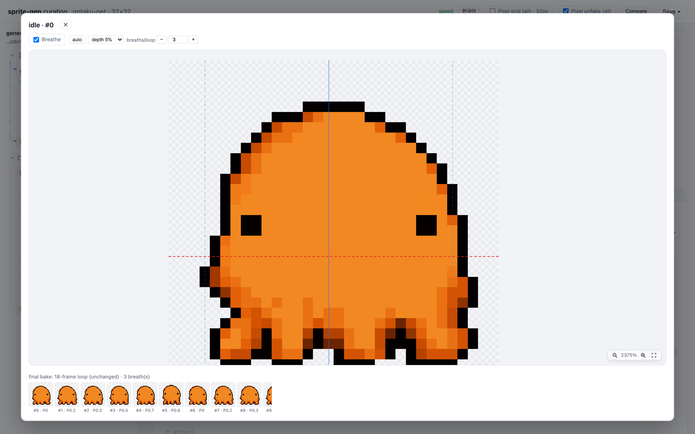
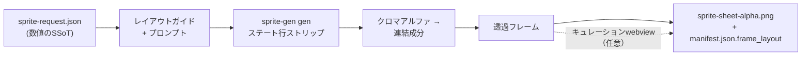
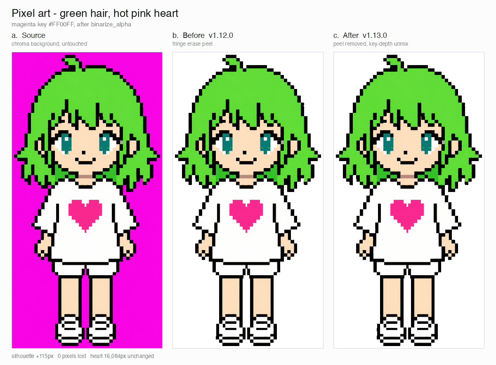
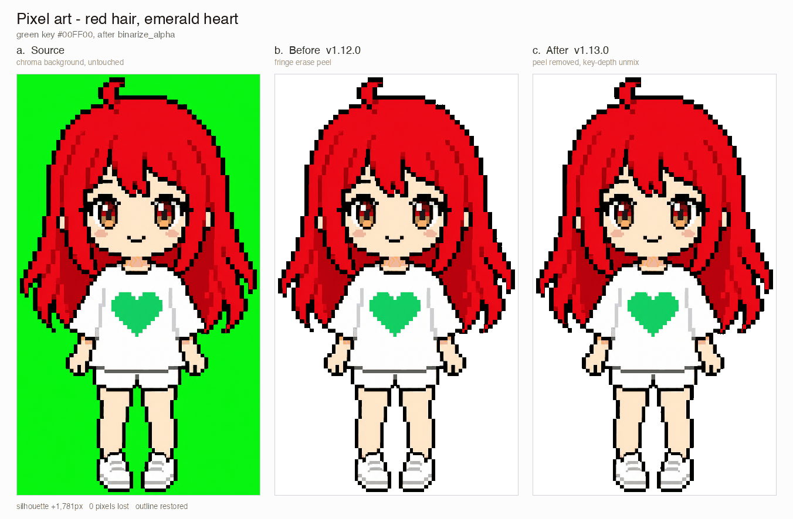
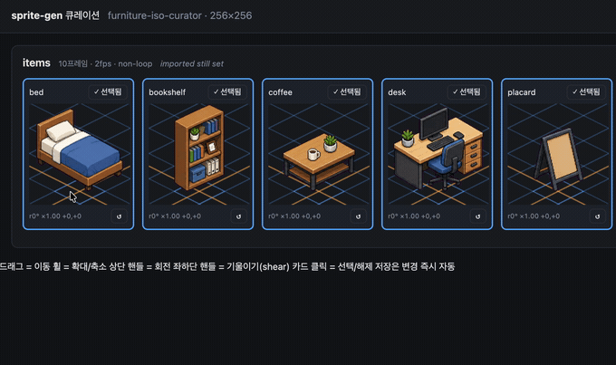
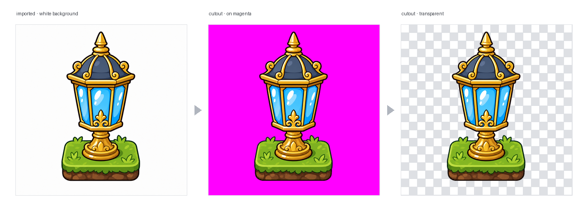

<h1 align="center">sprite-gen</h1>

<p align="center"><b>1枚の絵を入力。ゲーム対応のスプライトアトラスを出力——息づく姿で。</b></p>

<p align="center">

**English** · [한국어](README.ko.md) · [日本語](README.ja.md) · [简体中文](README.zh-Hans.md) · [Español](README.es.md) · [Français](README.fr.md)

</p>

---

## Breathe

静止した待機姿勢は、凍りついて見えます。**Breathe**は、厳選したフレームに決定論的なスカッシュ＆ストレッチをベイクし、1つのポーズを生きたループへ変えます。再生成も、再抽出も、追加アートも不要です。必要なのはサイドカーのフィールド1つだけです。

```json
"breathe": { "depth": 0.05, "breaths": 3 }
```

- **解剖学を考慮。** エンジンはシルエットを計測します。首のくびれ、首のない塊にある左右対称の目、胴体と付属肢の幅。頭部はすべてのフレームで**ビット単位で同一**に保たれ、翼や腕は押し動かされますが、引き伸ばされることはありません。
- **ピクセルに忠実。** 整数による行・列のマッピングのみを使用するため、すべての出力フレームは同じグリッド上のクリーンなピクセルアートのままです。1pxの輪郭は1pxのまま維持されます。ワープはシルエットのエッジを保ち、内側の線を基準に階段状の重複を正規化します。
- **直接つかめる定規。** ライブ再生上で、剛体境界（赤）、身体軸（青）、胴体幅（破線）をドラッグできます。離すとサーバーが解剖構造を再導出し、再計算中もプレビューは呼吸し続けます。
- **プレビューとバイト単位で同一。** webviewのミラーとPythonのベイクは同じバイト列を生成し、ゴールデンテストによって保証されています。ループ再生で見ているものが、そのままアトラスに収録されます。

<p align="center">
  
</p>

同じ決定論的なベイクは、人型、ブロブ、触手など、あらゆるシルエットの正面、側面、背面に適用できます。

画像モデルに「スプライトシート」を頼むと、何が出てくるかはご存じでしょう。フレームごとに顔が変わるキャラクター、キーイングできない背景、重なり合ってグリッドからずれていくポーズ、そしてゲームエンジンでは実際に使えないPNG。デモとしてはかわいくても、アセットとしては役に立ちません。

`sprite-gen`は、その隔たりを埋めるCodex/Claudeスキルです。**1枚のベース画像**とアクションの一覧を渡すと、行ごとに生成を進め、キャラクターの同一性を固定し、クロマ背景を本物のアルファへ変換し、各ポーズをクリーンな透過フレームとして抽出し、**機械可読な`manifest.json.frame_layout`付き**のランタイムアトラスをベイクします。

そして、生成だけではどうしても仕上がらない最後の10%のために、**キュレーションwebview**があります。フレームを並べて比較し、壊れたものを除外し、回転・スケール・位置を非破壊で微調整し、ループをライブで確認してからベイクできます。パイプラインが作業を担い、あなたは審美眼を発揮できます。

```text
sprite-request.json → レイアウトガイド + プロンプト → sprite-gen genのステート行
→ クロマアルファ → 連結成分 → 透過フレーム
→ sprite-sheet-alpha.png + manifest.json.frame_layout
```



> 完全なアーキテクチャ：[`docs/architecture.md`](docs/architecture.md)

## 実際に得られるもの

- **透過スプライトアトラス**（`sprite-sheet-alpha.png`）——本物のアルファを使用し、クロマの縁取りが残っていないことを白背景で検証済みです。
- **ランタイムマニフェスト**（`manifest.json.frame_layout`）——絶対座標のフレーム矩形、ステートごとのfps、ループフラグを収録しています。エンジンは矩形を参照するだけで、グリッドを推測する必要はありません。
- **決定論的なカラーバリエーション**——`sprite-gen recolor`は、ベースシートとパレットマップを受け取り、1つのコマンドでN個のバリエーションシートをベイクします（デフォルトではRGBの完全一致。同じ入力からは同じ出力バイト列を生成）。キュレーションwebviewでは点滅比較ができ、採用した名前も記録されます。詳細：[`docs/recolor.md`](docs/recolor.md)。
- **目で確認できるQA**——ステートごとのGIFとコンタクトシートにより、出荷前に動きを動きとして評価できます。
- **誠実なラベル**——短く読みやすいアクション（idle、jump、attack、wave）が安定したパスです。周期的な移動（walk/run）は、モーションQAを実際に通過しない限り実験的と明記されます。黙って過剰な約束をすることはありません。

## クロマアルファの品質

抽出処理では、クロマ除去を決定論的に維持します。ソフトアルファ・アンミックスにより、アンチエイリアスされた髪の房や細い輪郭を、カバレッジを解決する前に剥ぎ取ることなく保持します。

<p align="center">
  <br />
  <em>イラスト、マゼンタキー：ソース、v1.12.0の剥離、v1.13.0のソフトアルファ・アンミックス。</em>
</p>

<p align="center">
  <br />
  <em>イラスト、グリーンキー：ソース、v1.12.0の剥離、v1.13.0のソフトアルファ・アンミックス。</em>
</p>

<p align="center">
  <br />
  <em>ピクセルアート、マゼンタキー：ソース、v1.12.0の剥離、v1.13.0の二値化出力。</em>
</p>

<p align="center">
  <br />
  <em>ピクセルアート、グリーンキー：ソース、v1.12.0の剥離、v1.13.0の二値化出力。</em>
</p>

以下の拡大クロップは、全身比較の裏側にあるエッジの詳細を示しています。


## Backbone Lattice

AI生成の「ピクセルアート」は、ピクセルアートではありません。ブロックは揺らぎ、エッジにはアンチエイリアスが付き、1つの行の中でも格子がずれていくため、均等なグリッドで切り出すと、あるブロックが隣のブロックへにじみます。コミュニティで使われる解決策は、画像を「unfake」することです。ランレングスからブロックサイズを推定し、再量子化します。しかし、これは各フレームを個別に計測するため、歩行サイクルのセルサイズがフレームごとに膨らんだり縮んだりします。

**Backbone Lattice**は、対象全体に対して1つのグリッドを計測し、すべての切り出しをそのグリッドに固定します。フレームごとのピッチ検出結果を、行全体かつフレーム横断の合意形成に入力し、高調波による誤検出を多数決で排除します。その合意グリッドが、すべての切り出し先となる*バックボーン*です。切り出し位置は実際の色境界に置かれ、計測したピッチに比例する最小セル幅によって、隣接する2つの切り出し位置が同じ帯へ潰れることを防ぎます。バックボーンが1つなので、同じブロックはアニメーション全体で同じサイズを保ち、フレーム間で跳ねることがありません。

結果は、選び抜いた1フレームを目視するのではなく、実際に出荷されたものに対して検証されます。pixel-unfakeの各実行結果は、それぞれのソースストリップから再導出され、ピクセル単位で比較されます。承認した形状はそのまま維持され、変わるのは輪郭と陰影が置かれる位置だけです。それこそがバックボーンの決定するものです。

## キュレーションwebview

生成で90%まで到達できます。webviewは、人間がそれを*出荷可能*な状態へ仕上げる場所です。単独で動作し、Studioやフレームワークには依存せず、スキルがインストールされている場所ならどこでも実行できます（Claude Code Desktop、Codexアプリ、通常のターミナル）。


- **ステートごとに2行：** 上段は**再生シーケンス**、下段は**候補プール**です（たとえば、2回目や3回目に生成した別テイク）。フレームの⠿グリップをドラッグしてシーケンスを並べ替えたり、プールから切り出しを上へ移したりできます。複数テイクの最良フレームを組み合わせて、クリーンな1つの走行ループを再構築できます。配置は保存されるため、再度開いたときに復元されます。
- フレームごとの**非破壊変形**：ドラッグ = 移動、ホイール = 拡大縮小、上部ハンドル = 回転、左下 = シアー、さらに左右反転した出力用の水平反転トグルがあります。編集内容は`curation.json`サイドカーに保存され、ソースPNGが書き換えられることはありません。合成ステップが結果を決定論的にベイクします。プレビューとベイクは同じアフィン行列を共有するため、位置合わせしたとおりの結果が得られます。
- **ライブプレビュー**は、ステートのfpsでシーケンスをアニメーション再生します。再生・一時停止、フレーム単位のステップ移動、0.25×～4×の速度調整に対応しています。
- スプライト専用ではありません。`unpack_atlas_run.py --pngs-dir`で画像候補（アイコン、ロゴ、生成した下書き）の任意のフォルダーを指定すれば、汎用的な勝者選択ビューとして使えます。

### アイソメトリック地面グリッド

アイソメトリックセットでは、webviewが床グリッド（`meta.json`のtile/anchorから取得）をオーバーレイするため、シアーハンドルを使って家具をひし形の軸へスナップできます。




### 言語

webviewには英語と韓国語が付属しています。起動時に`--lang en|ko`を渡すか、アプリ内の切り替えを使用してください。

```bash
python3 scripts/serve_curation.py --run-dir <run-dir> --lang en   # またはko
```

## Pythonサポート

`sprite-gen`はCPython 3.10以降をサポートしています。CIは、GitHubホストランナー上でサポート対象の最小バージョン（3.10）と最新の対象バージョン（3.14）を実行します。

クイックスタートには、`venv`/`ensurepip`が正常に動作するPython環境が必要です。ローカルディストリビューションで、パッケージのインストール前に`python3 -m venv`が失敗する場合は、サポート対象バージョンの標準CPythonビルドを使用し、同じコマンドを再実行してください。

## クイックスタート

```bash
# 0. 新しい仮想環境に依存関係（Pillow、NumPy）をインストール
python3 -m venv .venv && source .venv/bin/activate
pip install -e .

# 1. ベース画像から実行環境を準備
python3 scripts/prepare_sprite_run.py --out-dir <run-dir> --character-id <id> --base-image base.png

# 2. エンジン管理のプロバイダーCLIでステートごとに1枚の行画像を生成
python3 scripts/generate_sprite_image.py --provider codex \
  --prompt-file <run-dir>/prompts/<state>.txt \
  --out <run-dir>/raw/<state>.png \
  --ref <run-dir>/base-source.png \
  --ref <run-dir>/references/layout-guides/<state>.png
# 3. フレームを抽出
python3 scripts/extract_sprite_row_frames.py --run-dir <run-dir>

# 4. （任意）webviewでフレームをキュレーション
python3 scripts/serve_curation.py --run-dir <run-dir>

# 5. ランタイムアトラスをベイク
python3 scripts/compose_sprite_atlas.py --run-dir <run-dir>
```

### 完成済みシートの編集

結合済みシートだけが残っている場合は、キュレーター対応の実行ディレクトリを再構築し、キュレーションしてエクスポートします。

```bash
# フレームを再構築：明示的な--grid、--manifestの矩形、またはアルファ自動検出（デフォルト）
python3 scripts/unpack_atlas_run.py --atlas sheet.png            # 自動検出
python3 scripts/unpack_atlas_run.py --manifest manifest.json     # 正確な矩形
python3 scripts/unpack_atlas_run.py --pngs-dir furniture/        # 個別PNGセットをインポート

# キュレーション後、修正内容を名前付きPNGへベイク
python3 scripts/export_curated_pngs.py --run-dir <run-dir>
```

出力先はデフォルトで、入力の隣に作成される見つけやすい `<source>-curator` フォルダーです。

### 完成したシートのカラーバリエーションを焼き込む

アトラスを構成した後、生成を再実行せずに、選択した色を置き換えて N 枚の完成シートを作成できます。ドット絵ではデフォルトで完全一致を使用し、ソフトエッジのアートでは許容差を指定できます。ジオメトリとアルファは一切変化せず、ベースマニフェストがすべてのバリアントを記述します。

```bash
# 不透明色のドラフトを作成（kind が "sprite-gen-recolor" の recolor spec に編集）
python3 -m sprite_gen.cli recolor-palette --base <run-dir>/sprite-sheet-alpha.png --out palette.draft.json

# すべてのカラーバリエーションを <run-dir>/variants/ に焼き込む
python3 -m sprite_gen.cli recolor --run-dir <run-dir> --spec recolor.spec.json

# キュレーションビューで点滅比較し、採用する
python3 -m sprite_gen.cli curation --run-dir <run-dir>
```

完全な spec/report コントラクトと採用用サイドカーフィールドについては、[`docs/recolor.md`](docs/recolor.md) を参照してください。

### インポートした画像から背景を切り抜く

生成されたスプライトはパイプライン内で固有のマゼンタ／グリーン背景を基準に処理されるため、この操作は不要です。`cutout` はインポート／後編集用ユーティリティです。不透明で均一な背景が付いた状態で取り込まれた画像（手描きアイコン、ダウンロードしたスプライト、スクリーンショット）を、きれいな透過 PNG に変換します。

<p align="center">
  
</p>

```bash
# コーナーの色に応じて振り分け：白／アイボリー -> matte、マゼンタ／グリーン -> extract エンジン
python3 -m sprite_gen.cli cutout icon.png --white-check
```

コーナーの背景色を読み取り、処理を振り分けます（`--key auto|white|magenta|green`）。

- **白／アイボリー／単色** → position matte。コーナーからの flood-fill により、接続している背景だけを保持します（オブジェクトの*内部*にある明るいハイライトは穴にならず残ります）。その後、色かぶりを除去したソフトアルファで境界をぼかします。`--strength`（ベベル除去）、`--band`（エッジ深度）、`--erode` で調整できます。
- **マゼンタ／グリーンキー** → プロジェクトで検証済みの `extract` クロマエンジンをそのまま再利用します。キー色はオブジェクト内に現れないため、色だけに基づく切り抜きを安全に行えます。これはまさに、白マットの flood-fill ガードが*不要*な場合です。

`--white-check` はシアン／マゼンタ／イエローの合成画像を書き出すため、残ったフリンジが目立って確認できます。均一な背景向けであり、複雑または不均一な背景には適していません。

エージェント向けの完全なワークフローとコントラクトは、[`SKILL.md`](SKILL.md) にあります。

## インストール

Codex skill installer ワークフローから、このリポジトリをルートスキルとしてインストールします。

```bash
python3 ~/.codex/skills/.system/skill-installer/scripts/install-skill-from-github.py \
  --repo aldegad/sprite-gen --path .
```

### 画像生成の所有権

プロバイダーを利用した生成はこのエンジン（`sprite_gen.gen`）の一部であり、サポートされるプロバイダーは `codex` と `grok` です。汎用の `image-gen` スキルは同じコマンドへの薄いシャトルにすぎないため、2 つ目のプロバイダー実装は必要ありません。CLI と検証コントラクトについては、[`docs/gen.md`](docs/gen.md) を参照してください。

## 帰属表示

コンポーネント行ワークフローは、Apache-2.0 ライセンスの `hatch-pet` スキルから着想を得ていますが、汎用ゲームスプライトアトラスを対象としており、ペットパッケージやペットのビジュアルアセットは一切含まれていません。

## ライセンス

Apache-2.0
