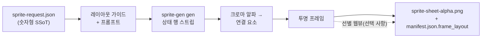

<h1 align="center">sprite-gen</h1>

<p align="center"><b>그림 한 장을 넣으면, 바로 게임에 쓸 수 있는 스프라이트 아틀라스가 나옵니다 — 숨을 쉬면서.</b></p>

<p align="center">

[English](README.md) · **한국어** · [日本語](README.ja.md) · [简体中文](README.zh-Hans.md) · [Español](README.es.md) · [Français](README.fr.md)

</p>

---

## 호흡

정지된 대기 자세는 얼어붙은 것처럼 보입니다. **호흡**은 하나의 자세를 살아 있는 루프로 바꿉니다 — 선별한 프레임 위에 결정론적 스쿼시 앤 스트레치(squash & stretch)를 베이크합니다. 재생성도, 재추출도, 추가 아트도 필요 없습니다. 사이드카 필드 하나면 됩니다.

```json
"breathe": { "depth": 0.05, "breaths": 3 }
```

- **해부학 인식.** 엔진이 실루엣을 측정합니다. 목의 잘록한 지점, 목이 없는 덩어리의 대칭적인 눈 한 쌍, 몸통과 부속지의 너비를 분석합니다. 머리는 모든 프레임에서 **바이트 단위로 동일하게** 유지되며, 날개와 팔은 늘어나지 않고 밀려납니다.
- **픽셀 그대로.** 정수 행/열 매핑만 사용하므로 모든 출력 프레임이 같은 격자 위의 깔끔한 픽셀 아트로 유지됩니다. 1px 외곽선은 계속 1px 외곽선입니다. 워프는 안쪽 선을 기준으로 실루엣 가장자리를 보존하고 계단 현상의 중복을 정규화합니다.
- **직접 잡을 수 있는 자.** 실시간 재생 화면에서 강체 경계선(빨간색), 몸체 축(파란색), 몸통 너비(점선)를 직접 드래그할 수 있습니다. 놓는 순간 서버가 해부 구조를 다시 계산하며, 재계산 중에도 미리보기는 계속 숨을 쉽니다.
- **바이트 단위로 동일한 미리보기.** 웹뷰 미러와 Python 베이크는 동일한 바이트를 생성하며, 골든 테스트로 이를 보장합니다. 루프로 보고 있는 바로 그 결과가 아틀라스에 그대로 담깁니다.

<p align="center">
  
</p>

같은 결정론적 베이크는 사람형, 덩어리형, 촉수형 등 어떤 실루엣의 정면, 측면, 후면에도 적용됩니다.

이미지 모델에 "스프라이트 시트"를 요청하면 어떤 결과가 나오는지 아실 겁니다. 프레임마다 얼굴이 달라지는 캐릭터, 키잉으로 제거되지 않는 배경, 서로 겹치고 격자를 벗어나는 자세, 그리고 게임 엔진에서 실제로 사용할 수 없는 PNG가 나옵니다. 귀여운 데모지만 쓸모없는 에셋입니다.

`sprite-gen`은 그 간극을 메우는 Codex/Claude 스킬입니다. **기본 이미지 한 장**과 동작 목록을 주면 행 단위로 생성을 진행하고, 캐릭터의 정체성을 고정하고, 크로마 배경을 실제 알파로 제거하고, 각 자세를 깔끔한 투명 프레임으로 추출한 뒤 **기계가 읽을 수 있는 `manifest.json.frame_layout`을 포함한** 런타임 아틀라스를 베이크합니다.

생성만으로는 제대로 완성되지 않는 마지막 10%를 위해 **선별 웹뷰**도 제공합니다. 프레임을 나란히 비교하고, 망가진 프레임을 제외하고, 회전·크기·위치를 비파괴 방식으로 미세 조정하고, 루프를 실시간으로 확인한 뒤 베이크할 수 있습니다. 파이프라인이 노동을 맡고, 여러분은 안목을 발휘하면 됩니다.

```text
sprite-request.json → 레이아웃 가이드 + 프롬프트 → sprite-gen gen 상태 행
→ 크로마 알파 → 연결 요소 → 투명 프레임
→ sprite-sheet-alpha.png + manifest.json.frame_layout
```



> 전체 아키텍처: [`docs/architecture.md`](docs/architecture.md)

## 실제로 얻는 결과물

- **투명 스프라이트 아틀라스** (`sprite-sheet-alpha.png`) — 실제 알파를 사용하고 남은 크로마 테두리가 없으며, 흰색 배경을 기준으로 검증됩니다.
- **런타임 매니페스트** (`manifest.json.frame_layout`) — 절대 좌표 프레임 사각형과 상태별 fps 및 루프 플래그를 제공합니다. 엔진은 사각형 영역을 샘플링할 뿐, 격자를 추측하지 않습니다.
- **결정론적 색상 변형** — `sprite-gen recolor`는 기본 시트와 팔레트 맵을 받아 한 번의 명령으로 N개의 변형 시트를 베이크합니다. 기본적으로 정확한 RGB 일치를 사용하며, 입력이 같으면 출력 바이트도 같습니다. 선별 웹뷰는 변형을 깜박이며 비교하고 채택한 이름을 기록합니다. 자세한 내용: [`docs/recolor.md`](docs/recolor.md).
- **눈으로 확인할 수 있는 QA** — 상태별 GIF와 콘택트 시트를 제공하므로, 무엇이든 출시하기 전에 움직임을 움직임 자체로 평가할 수 있습니다.
- **정직한 표기** — 짧고 명확한 동작(idle, jump, attack, wave)은 안정적인 경로입니다. 주기적 이동 동작(walk/run)은 모션 QA를 실제로 통과하지 않는 한 실험적 기능으로 표시됩니다. 조용히 과장하지 않습니다.

## 크로마 알파 품질

추출기는 크로마 정리를 결정론적으로 유지합니다. 소프트 알파 언믹스는 커버리지를 계산하기 전에 앤티앨리어싱된 머리카락과 얇은 외곽선을 벗겨내지 않고 보존합니다.

<p align="center">
  <br />
  <em>일러스트레이션, 마젠타 키: 원본, v1.12.0 필, v1.13.0 소프트 알파 언믹스.</em>
</p>

<p align="center">
  <br />
  <em>일러스트레이션, 그린 키: 원본, v1.12.0 필, v1.13.0 소프트 알파 언믹스.</em>
</p>

<p align="center">
  <br />
  <em>픽셀 아트, 마젠타 키: 원본, v1.12.0 필, v1.13.0 이진화 출력.</em>
</p>

<p align="center">
  <br />
  <em>픽셀 아트, 그린 키: 원본, v1.12.0 필, v1.13.0 이진화 출력.</em>
</p>

아래의 확대 이미지는 전신 비교 결과를 만들어낸 가장자리의 세부 모습을 보여줍니다.


## 백본 격자

AI가 생성한 "픽셀 아트"는 픽셀 아트가 아닙니다. 블록이 흔들리고, 가장자리에 앤티앨리어싱이 남으며, 하나의 행 안에서도 격자가 떠다닙니다. 따라서 균일한 격자로 자르면 한 블록이 다음 블록에 번져 들어갑니다. 커뮤니티에서 사용하는 해결책은 이미지를 "가짜 픽셀 아트가 아니게" 만드는 것입니다. 연속 길이에서 블록 크기를 추측하고 다시 양자화하는 방식입니다. 하지만 이 방법은 각 프레임을 개별적으로 측정하기 때문에 걷기 사이클의 셀 크기가 프레임마다 숨 쉬듯 달라집니다.

**백본 격자**는 피사체 전체에 사용할 하나의 격자를 측정하고 모든 컷을 그 격자에 고정합니다. 프레임별 피치 감지 결과를 행 전체와 프레임 전체의 합의 과정에 입력해 배수 관계를 잘못 감지한 결과를 배제합니다. 이렇게 합의된 격자가 모든 컷이 스냅되는 *백본*입니다. 컷은 실제 색상 경계에 놓이며, 측정된 피치에 비례하는 최소 셀 너비를 적용해 인접한 두 컷이 같은 밴드로 겹치는 일을 방지합니다. 하나의 백본을 사용하므로 애니메이션 전체에서 동일한 블록은 프레임마다 튀지 않고 같은 크기를 유지합니다.

결과는 손으로 고른 프레임을 눈대중으로 확인하는 대신 실제 출시된 결과를 기준으로 검증합니다. 모든 픽셀 언페이크 실행 결과를 자체 원본 스트립에서 다시 도출해 픽셀 단위로 비교합니다. 승인한 형태는 그대로 유지되며, 바뀌는 것은 외곽선과 음영이 놓이는 위치뿐입니다. 그리고 그것이 바로 백본이 결정하는 부분입니다.

## 선별 웹뷰

생성으로 90%까지 완성할 수 있습니다. 웹뷰는 사람이 결과를 *출시 가능한 상태*로 만드는 곳입니다. 독립 실행형이며 Studio나 프레임워크에 의존하지 않고, 스킬이 설치된 모든 환경(Claude Code Desktop, Codex 앱, 일반 터미널)에서 실행됩니다.


- **상태별 두 개의 행:** 위에는 **재생 시퀀스**, 아래에는 **후보 풀**이 표시됩니다(예: 두 번째 또는 세 번째 생성 시안). 프레임의 ⠿ 핸들을 드래그해 시퀀스 순서를 바꾸거나 풀의 컷을 위로 끌어올릴 수 있습니다. 여러 시안의 최적 프레임을 조합해 깔끔한 달리기 루프 하나를 다시 만들 수 있습니다. 배치 상태는 저장되므로 다시 열어도 그대로 복원됩니다.
- 프레임별 **비파괴 변환:** 드래그 = 이동, 휠 = 크기 조절, 위쪽 핸들 = 회전, 왼쪽 아래 = 전단 변형이며, 좌우가 뒤집힌 출력을 위한 수평 반전 토글도 제공합니다. 편집 내용은 `curation.json` 사이드카에 저장됩니다. 원본 PNG는 절대 다시 쓰지 않으며, 합성 단계에서 결과를 결정론적으로 베이크합니다. 미리보기와 베이크가 하나의 아핀 행렬을 공유하므로 정렬한 그대로 결과를 얻습니다.
- **실시간 미리보기**는 상태의 fps에 맞춰 시퀀스를 애니메이션으로 재생하며, 재생/일시정지, 프레임 단위 이동, 0.25×–4× 속도 조절 기능을 제공합니다.
- 스프라이트만을 위한 도구가 아닙니다. `unpack_atlas_run.py --pngs-dir`로 이미지 후보 폴더(아이콘, 로고, 생성된 초안)를 지정하면 범용 우승작 선택 화면으로 사용할 수 있습니다.

### 아이소메트릭 바닥 격자

아이소메트릭 세트에서는 웹뷰가 바닥 격자(`meta.json`의 타일/앵커 정보)를 오버레이하므로, 전단 핸들을 사용해 가구를 다이아몬드 축에 맞춰 스냅할 수 있습니다.


### 언어

웹뷰는 영어와 한국어를 제공합니다. 실행할 때 `--lang en|ko`를 전달하거나 앱 내 토글을 사용하세요.

```bash
python3 scripts/serve_curation.py --run-dir <run-dir> --lang en   # 또는 ko
```

## Python 지원

`sprite-gen`은 CPython 3.10 이상을 지원합니다. CI는 GitHub 호스팅 러너에서 지원되는 최소 버전(3.10)과 최신 검사 대상 버전(3.14)을 실행합니다.

빠른 시작에는 `venv`/`ensurepip`가 정상적으로 작동하는 Python 설치가 필요합니다. 로컬 배포판에서 패키지를 설치하기도 전에 `python3 -m venv`가 실패한다면, 지원되는 버전의 표준 CPython 빌드를 사용해 같은 명령을 다시 실행하세요.

## 빠른 시작

```bash
# 0. 새 가상 환경에 의존성(Pillow, NumPy) 설치
python3 -m venv .venv && source .venv/bin/activate
pip install -e .

# 1. 기본 이미지에서 실행 준비
python3 scripts/prepare_sprite_run.py --out-dir <run-dir> --character-id <id> --base-image base.png

# 2. 엔진이 소유한 제공자 CLI로 상태별 행 이미지 하나씩 생성
python3 scripts/generate_sprite_image.py --provider codex \
  --prompt-file <run-dir>/prompts/<state>.txt \
  --out <run-dir>/raw/<state>.png \
  --ref <run-dir>/base-source.png \
  --ref <run-dir>/references/layout-guides/<state>.png
# 3. 프레임 추출
python3 scripts/extract_sprite_row_frames.py --run-dir <run-dir>

# 4. (선택 사항) 웹뷰에서 프레임 선별
python3 scripts/serve_curation.py --run-dir <run-dir>

# 5. 런타임 아틀라스 베이크
python3 scripts/compose_sprite_atlas.py --run-dir <run-dir>
```

### 완성된 시트 편집하기

결합된 시트만 남아 있다면 선별 도구에서 사용할 수 있는 실행 디렉터리를 다시 만든 뒤, 선별하고 내보내세요.

```bash
# 프레임 재구성: 명시적 --grid, --manifest 사각형 또는 알파 자동 감지(기본값)
python3 scripts/unpack_atlas_run.py --atlas sheet.png            # 자동 감지
python3 scripts/unpack_atlas_run.py --manifest manifest.json     # 정확한 사각형
python3 scripts/unpack_atlas_run.py --pngs-dir furniture/        # 개별 PNG 세트 가져오기

# 선별 후 수정 사항을 이름이 지정된 PNG에 다시 베이크
python3 scripts/export_curated_pngs.py --run-dir <run-dir>
```

출력은 기본적으로 입력 파일 옆의 찾기 쉬운 `<source>-curator` 폴더에 저장됩니다.

### 완성된 시트의 색상 변형 베이킹

아틀라스 구성이 끝나면 생성을 다시 실행하지 않고 선택한 색상을 교체해 N개의 완성된 시트를 만들 수 있습니다. 도트 아트는 기본적으로 정확히 일치하는 색상을 사용하며, 가장자리가 부드러운 아트에는 허용 오차를 적용할 수 있습니다. 지오메트리와 알파는 절대 움직이지 않으며, 기본 매니페스트가 모든 변형을 기술합니다.

```bash
# 불투명 색상 초안 생성(kind가 "sprite-gen-recolor"인 리컬러 명세로 편집)
python3 -m sprite_gen.cli recolor-palette --base <run-dir>/sprite-sheet-alpha.png --out palette.draft.json

# 모든 색상 변형을 <run-dir>/variants/에 베이킹
python3 -m sprite_gen.cli recolor --run-dir <run-dir> --spec recolor.spec.json

# 큐레이션 뷰에서 깜빡임 비교 후 채택
python3 -m sprite_gen.cli curation --run-dir <run-dir>
```

전체 명세/리포트 계약과 채택 사이드카 필드: [`docs/recolor.md`](docs/recolor.md).

### 가져온 이미지에서 배경 잘라내기

생성된 스프라이트는 파이프라인 내부에서 자체 마젠타/그린 배경을 기준으로 키잉되므로 이 작업이 필요하지 않습니다. `cutout`은 가져오기/후편집 유틸리티입니다. 불투명한 단색 배경이 *포함된 채* 들어온 이미지(손으로 그린 아이콘, 다운로드한 스프라이트, 스크린샷)를 깔끔한 투명 PNG로 변환합니다.

<p align="center">
  
</p>

```bash
# 모서리 색상을 기준으로 라우팅: 흰색/아이보리 -> 매트, 마젠타/그린 -> 추출 엔진
python3 -m sprite_gen.cli cutout icon.png --white-check
```

모서리의 배경색을 읽어 라우팅합니다(`--key auto|white|magenta|green`).

- **흰색 / 아이보리 / 단색** → 위치 기반 매트. 모서리 플러드 필은 연결된 배경만 유지하므로 객체 *내부*의 밝은 하이라이트는 구멍이 뚫리지 않고 살아남습니다. 그런 다음 색 오염을 제거한 부드러운 알파가 테두리를 자연스럽게 흐립니다. `--strength`(베벨 제거), `--band`(가장자리 깊이), `--erode`로 조정하세요.
- **마젠타 / 그린 키** → 프로젝트에서 검증된 `extract` 크로마 엔진을 그대로 재사용합니다. 키 색상은 객체에 절대 나타나지 않으므로 색상만으로 잘라내도 안전합니다. 이는 흰색 매트의 플러드 필 보호 장치가 *필요하지 않은* 바로 그 경우입니다.

`--white-check`는 시안/마젠타/옐로 합성 이미지를 생성하여 남은 테두리가 선명하게 드러나게 합니다. 균일한 배경용이며, 복잡하거나 불균일한 배경에는 적합하지 않습니다.

에이전트용 전체 워크플로와 계약은 [`SKILL.md`](SKILL.md)에 있습니다.

## 설치

Codex 스킬 설치 워크플로에서 이 저장소를 루트 스킬로 설치합니다.

```bash
python3 ~/.codex/skills/.system/skill-installer/scripts/install-skill-from-github.py \
  --repo aldegad/sprite-gen --path .
```

### 이미지 생성 소유권

프로바이더 기반 생성은 이 엔진(`sprite_gen.gen`)의 일부이며, 지원되는 프로바이더는 `codex`와 `grok`입니다. 범용 `image-gen` 스킬은 같은 명령으로 전달하는 얇은 셔틀일 뿐이므로 별도의 프로바이더 구현이 필요하지 않습니다. CLI와 검증 계약은 [`docs/gen.md`](docs/gen.md)를 참조하세요.

## 저작자 표시

컴포넌트 행 워크플로는 Apache-2.0 라이선스의 `hatch-pet` 스킬에서 영감을 얻었지만, 범용 게임 스프라이트 아틀라스를 대상으로 하며 펫 패키지나 펫 시각 에셋은 포함하지 않습니다.

## 라이선스

Apache-2.0
