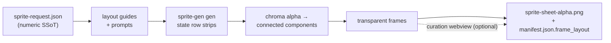

<h1 align="center">sprite-gen</h1>

<p align="center"><b>One drawing in. A game-ready sprite atlas out — breathing.</b></p>

<p align="center">

**English** · [한국어](README.ko.md) · [日本語](README.ja.md) · [简体中文](README.zh-Hans.md) · [Español](README.es.md) · [Français](README.fr.md)

</p>

---

## Breathe

A still idle reads as frozen. **Breathe** turns a single pose into a living loop — deterministic squash & stretch baked on top of your curated frames. No regeneration, no re-extraction, no extra art. One sidecar field:

```json
"breathe": { "depth": 0.05, "breaths": 3 }
```

- **Anatomy-aware.** The engine measures the silhouette: neck bottleneck, symmetric eye pair on neckless blobs, torso-vs-appendage width. Heads stay **bit-identical** across every frame; wings and arms get pushed, never stretched.
- **Pixel-true.** Integer row/column mapping only — every output frame is still clean pixel art on the same grid. A 1px outline stays a 1px outline: the warp preserves silhouette edges and normalizes staircase doubling, anchored on the inner line.
- **A ruler you can grab.** Drag the rigid boundary (red), the body axis (blue), and the torso width (dashed) right on the live playback. The server re-derives the anatomy on release — and the preview keeps breathing while it recalculates.
- **Byte-identical preview.** The webview mirror and the Python bake produce the same bytes, enforced by golden tests. What you watch looping is exactly what ships in the atlas.

<p align="center">
  
</p>

The same deterministic bake applies to front, side, and back views of any silhouette, including humanoids, blobs, and tentacles.

Ask an image model for a "sprite sheet" and you know what you get: a character whose face changes every frame, a background that won't key out, poses that overlap and drift off-grid, and a PNG your game engine can't actually consume. Cute demo, useless asset.

`sprite-gen` is a Codex/Claude skill that closes that gap. Give it **one base image** and a list of actions — it drives the generation row by row, locks the character's identity, strips the chroma background to real alpha, extracts each pose as a clean transparent frame, and bakes a runtime atlas **with a machine-readable `manifest.json.frame_layout`**.

And for the last 10% that generation never gets right, there's a **curation webview**: compare frames side by side, reject the broken ones, nudge rotation/scale/position non-destructively, watch the loop live — then bake. The pipeline does the labor; you keep the taste.

```text
sprite-request.json → layout guides + prompts → sprite-gen gen state rows
→ chroma alpha → connected components → transparent frames
→ sprite-sheet-alpha.png + manifest.json.frame_layout
```



> Full architecture: [`docs/architecture.md`](docs/architecture.md)

## What you actually get

- **A transparent sprite atlas** (`sprite-sheet-alpha.png`) — real alpha, no leftover chroma fringe, verified against white backgrounds.
- **A runtime manifest** (`manifest.json.frame_layout`) — absolute frame rectangles, per-state fps and loop flags. Your engine samples rectangles; it never guesses a grid.
- **Deterministic colourways** — `sprite-gen recolor` takes the base sheet plus a palette map and bakes N variant sheets in one command (exact RGB match by default; same input, same output bytes). The curation webview blink-compares them and records the adopted name. Detail: [`docs/recolor.md`](docs/recolor.md).
- **QA you can watch** — per-state GIFs and contact sheets, so motion is judged as motion before anything ships.
- **Honest labels** — short readable actions (idle, jump, attack, wave) are the stable path; cyclic locomotion (walk/run) is marked experimental unless motion QA actually passes. No silent overpromising.

## Chroma alpha quality

The extractor keeps chroma cleanup deterministic: soft-alpha unmix preserves antialiased hair strands and thin outlines instead of peeling them away before coverage can be solved.

<p align="center">
  <br />
  <em>Illustration, magenta key: source, v1.12.0 peel, v1.13.0 soft-alpha unmix.</em>
</p>

<p align="center">
  <br />
  <em>Illustration, green key: source, v1.12.0 peel, v1.13.0 soft-alpha unmix.</em>
</p>

<p align="center">
  <br />
  <em>Pixel art, magenta key: source, v1.12.0 peel, v1.13.0 binarized output.</em>
</p>

<p align="center">
  <br />
  <em>Pixel art, green key: source, v1.12.0 peel, v1.13.0 binarized output.</em>
</p>

The close-up crops below show the edge detail behind the full-body comparisons.


## Backbone Lattice

AI-generated "pixel art" is not pixel art. The blocks wobble, the edges carry antialiasing, and the lattice drifts within a single row, so cutting on an even grid smears one block into the next. The community fix is to "unfake" the image — guess the block size from run lengths and re-quantize — but that measures each frame on its own, so a walk cycle's cell size breathes frame to frame.

**Backbone Lattice** measures one grid for the whole subject and holds every cut to it. Per-frame pitch detection feeds a row-wide, cross-frame consensus that outvotes harmonic misdetections; that consensus grid is the *backbone* every cut snaps to. Cuts land on actual colour boundaries, and a minimum cell width proportional to the measured pitch keeps two neighbouring cuts from ever collapsing onto the same band. One backbone, so the same block stays the same size across a whole animation instead of jumping between frames.

The result is verified against what shipped, not eyeballed on a hand-picked frame: every pixel-unfake run is re-derived from its own source strip and compared pixel by pixel. The shape you approved stays the shape you get; what changes is only where outlines and shading land, which is exactly what the backbone decides.

## Curation webview

Generation gets you 90%. The webview is where a human takes it to *shipped* — standalone, no Studio or framework dependency, runs anywhere the skill is installed (Claude Code Desktop, the Codex app, a plain terminal).


- **Two rows per state:** the **play sequence** on top and a **candidate pool** below (e.g. a second or third generated take). Drag a frame's ⠿ grip to reorder the sequence, or pull a cut up from the pool — rebuild one clean run loop from the best frames across takes. The arrangement is saved, so reopening restores it.
- **Non-destructive transform** per frame: drag = move, wheel = scale, top handle = rotate, bottom-left = shear, plus a horizontal-flip toggle for left-right-reversed output. Edits live in a `curation.json` sidecar — source PNGs are never rewritten, and the compose step bakes the result deterministically. Preview and bake share one affine matrix, so what you align is what you get.
- **Live preview** animates the sequence at the state's fps, with play/pause, frame-by-frame stepping, and a 0.25×–4× speed control.
- Not just for sprites: point it at any folder of image candidates (icons, logos, generated drafts) with `unpack_atlas_run.py --pngs-dir` and use it as a general pick-the-winner view.

### Isometric ground grid

For isometric sets, the webview overlays the floor grid (from `meta.json` tile/anchor) so you can snap furniture to the diamond axes with the shear handle.


### Languages

The webview ships with English and Korean. Pass `--lang en|ko` when launching, or use the in-app toggle:

```bash
python3 scripts/serve_curation.py --run-dir <run-dir> --lang en   # or ko
```

## Python support

`sprite-gen` supports CPython 3.10+. CI runs the minimum supported version (3.10) and the latest covered version (3.14) on GitHub-hosted runners.

The quickstart requires a Python install with working `venv`/`ensurepip`. If `python3 -m venv` fails before package installation in a local distribution, use a standard CPython build for any supported version and rerun the same commands.

## Quickstart

```bash
# 0. install dependencies (Pillow, NumPy) into a fresh virtualenv
python3 -m venv .venv && source .venv/bin/activate
pip install -e .

# 1. prepare a run from a base image
python3 scripts/prepare_sprite_run.py --out-dir <run-dir> --character-id <id> --base-image base.png

# 2. generate one row image per state with the engine-owned provider CLI
python3 scripts/generate_sprite_image.py --provider codex \
  --prompt-file <run-dir>/prompts/<state>.txt \
  --out <run-dir>/raw/<state>.png \
  --ref <run-dir>/base-source.png \
  --ref <run-dir>/references/layout-guides/<state>.png
# 3. extract frames
python3 scripts/extract_sprite_row_frames.py --run-dir <run-dir>

# 4. (optional) curate frames in the webview
python3 scripts/serve_curation.py --run-dir <run-dir>

# 5. bake the runtime atlas
python3 scripts/compose_sprite_atlas.py --run-dir <run-dir>
```

### Editing a finished sheet

When only the combined sheet survives, rebuild a curator-ready run dir, then curate and export:

```bash
# rebuild frames: explicit --grid, --manifest rectangles, or alpha auto-detect (default)
python3 scripts/unpack_atlas_run.py --atlas sheet.png            # auto-detect
python3 scripts/unpack_atlas_run.py --manifest manifest.json     # exact rectangles
python3 scripts/unpack_atlas_run.py --pngs-dir furniture/        # import a loose PNG set

# after curating, bake corrections back to named PNGs
python3 scripts/export_curated_pngs.py --run-dir <run-dir>
```

Output defaults to a findable `<source>-curator` folder next to the input.

### Baking colourways of a finished sheet

Once the atlas is composed, swap selected colours into N finished sheets without
re-running generation. Dot art is exact-match by default; soft-edged art can opt
into a tolerance. Geometry and alpha never move — the base manifest describes
every variant.

```bash
# draft the opaque colours (edit into a recolor spec with kind "sprite-gen-recolor")
python3 -m sprite_gen.cli recolor-palette --base <run-dir>/sprite-sheet-alpha.png --out palette.draft.json

# bake every colourway into <run-dir>/variants/
python3 -m sprite_gen.cli recolor --run-dir <run-dir> --spec recolor.spec.json

# blink-compare and adopt in the curation view
python3 -m sprite_gen.cli curation --run-dir <run-dir>
```

Full spec/report contract and the adopt sidecar field: [`docs/recolor.md`](docs/recolor.md).

### Cutting a background off an imported image

Generated sprites are keyed off their own magenta/green background inside the
pipeline, so they never need this. `cutout` is the import/post-edit utility: an
image that arrived *with* an opaque uniform background (a hand-drawn icon, a
downloaded sprite, a screenshot) is turned into a clean transparent PNG.

<p align="center">
  
</p>

```bash
# routes on the corner colour: white/ivory -> matte, magenta/green -> extract engine
python3 -m sprite_gen.cli cutout icon.png --white-check
```

It reads the corner background colour and routes (`--key auto|white|magenta|green`):

- **white / ivory / solid** → position matte. A corner flood-fill keeps the
  connected background only (bright highlights *inside* the object survive, not
  holed), then a decontaminated soft alpha feathers the border. Tune with
  `--strength` (bevel removal), `--band` (edge depth), `--erode`.
- **magenta / green key** → the project's verified `extract` chroma engine is
  reused as-is. Key colours never appear in objects, so its colour-only cut is
  safe there — exactly where a white matte's flood-fill guard is *not* needed.

`--white-check` writes cyan/magenta/yellow composites so any leftover fringe
shows loudly. For uniform backgrounds; not for complex/non-uniform ones.

The full agent-facing workflow and contracts live in [`SKILL.md`](SKILL.md).

## Install

From Codex skill installer workflows, install this repository as a root skill:

```bash
python3 ~/.codex/skills/.system/skill-installer/scripts/install-skill-from-github.py \
  --repo aldegad/sprite-gen --path .
```

### Image generation ownership

Provider-backed generation is part of this engine (`sprite_gen.gen`), with
`codex` and `grok` as the supported providers. The general `image-gen` skill is
only a thin shuttle to the same command, so it does not need a second provider
implementation. See [`docs/gen.md`](docs/gen.md) for the CLI and verification
contract.

## Attribution

The component-row workflow is inspired by the Apache-2.0 licensed `hatch-pet` skill, but targets generic game sprite atlases and includes no pet packages or pet visual assets.

Community contributions, experiments, and their originating pull requests are documented in [`CONTRIBUTORS.md`](CONTRIBUTORS.md).

## License

Apache-2.0
