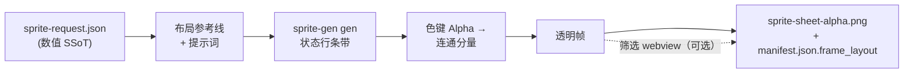

<h1 align="center">sprite-gen</h1>

<p align="center"><b>输入一张图，输出可直接用于游戏的精灵图集——会呼吸。</b></p>

<p align="center">

**英语** · [한국어](README.ko.md) · [日本語](README.ja.md) · [简体中文](README.zh-Hans.md) · [Español](README.es.md) · [Français](README.fr.md)

</p>

---

## 呼吸

静止的待机姿势看起来像被冻结了一样。**呼吸**功能通过在你精心筛选的帧上烘焙确定性的挤压与拉伸效果，将单一姿势变成鲜活的循环动画。无需重新生成，无需重新提取，也无需额外绘制。只需一个伴随字段：

```json
"breathe": { "depth": 0.05, "breaths": 3 }
```

- **感知解剖结构。** 引擎会测量轮廓：颈部收窄处、无颈团块上的对称双眼，以及躯干与附肢的宽度差异。每一帧中的头部都保持**逐比特完全一致**；翅膀和手臂只会被推动，绝不会被拉伸。
- **像素精准。** 仅使用整数行列映射——每个输出帧仍然是在同一网格上的干净像素画。1px 的轮廓始终保持为 1px：变形会保留轮廓边缘，并以内侧线条为锚点，规范化阶梯状像素的重复。
- **可以亲手拖动的标尺。** 直接在实时播放画面上拖动刚性边界（红色）、身体轴线（蓝色）和躯干宽度线（虚线）。松开后，服务器会重新推导解剖结构——重新计算期间，预览仍会继续呼吸。
- **逐字节一致的预览。** webview 镜像与 Python 烘焙会生成完全相同的字节，并由黄金测试强制保证。你看到的循环动画，就是最终随图集交付的内容。

<p align="center">
  
</p>

同一确定性烘焙适用于人形、团块、触手等任意轮廓的正面、侧面和背面视图。

让图像模型生成一张“精灵表”，你很清楚结果会是什么：角色的脸每一帧都在变化，背景无法干净抠除，姿势相互重叠并偏离网格，而且生成的 PNG 根本无法被游戏引擎直接使用。演示很可爱，素材却毫无用处。

`sprite-gen` 是一个填补这一缺口的 Codex/Claude 技能。给它**一张基础图像**和一组动作——它会逐行驱动生成过程、锁定角色身份、将色键背景剥离为真正的 Alpha 通道、把每个姿势提取为干净的透明帧，并烘焙出带有**机器可读 `manifest.json.frame_layout`** 的运行时图集。

对于生成始终无法处理好的最后 10%，还有一个**筛选 webview**：并排比较各帧、淘汰损坏的帧、以非破坏方式微调旋转/缩放/位置、实时观看循环动画——然后再进行烘焙。流水线负责苦工；品味由你掌控。

```text
sprite-request.json → 布局参考线 + 提示词 → sprite-gen gen 状态行
→ 色键 Alpha → 连通分量 → 透明帧
→ sprite-sheet-alpha.png + manifest.json.frame_layout
```



> 完整架构：[`docs/architecture.md`](docs/architecture.md)

## 你实际会得到什么

- **透明精灵图集**（`sprite-sheet-alpha.png`）——真正的 Alpha 通道，没有残留的色键边缘，并已在白色背景上验证。
- **运行时清单**（`manifest.json.frame_layout`）——包含绝对帧矩形，以及每个状态的 fps 和循环标志。你的引擎只需采样矩形，永远不必猜测网格。
- **确定性的配色变体**——`sprite-gen recolor` 接收基础精灵表和调色板映射，通过一条命令烘焙 N 张变体精灵表（默认精确匹配 RGB；相同输入会生成相同的输出字节）。筛选 webview 会通过闪烁对比这些变体，并记录最终采用的名称。详情：[`docs/recolor.md`](docs/recolor.md)。
- **可以亲眼查看的质量保证**——为每个状态生成 GIF 和接触表，让动画在交付前以动态形式接受评估。
- **诚实的标签**——简短易读的动作（idle、jump、attack、wave）是稳定路径；循环位移动作（walk/run）除非真正通过动态质量检查，否则会被标记为实验性功能。绝不暗中夸大承诺。

## 色键 Alpha 质量

提取器以确定性方式清理色键：软 Alpha 解混会保留经过抗锯齿处理的发丝和细轮廓，而不是在计算覆盖率之前就将它们剥除。

<p align="center">
  <br />
  <em>插画，洋红色键：源图、v1.12.0 剥离、v1.13.0 软 Alpha 解混。</em>
</p>

<p align="center">
  <br />
  <em>插画，绿色键：源图、v1.12.0 剥离、v1.13.0 软 Alpha 解混。</em>
</p>

<p align="center">
  <br />
  <em>像素画，洋红色键：源图、v1.12.0 剥离、v1.13.0 二值化输出。</em>
</p>

<p align="center">
  <br />
  <em>像素画，绿色键：源图、v1.12.0 剥离、v1.13.0 二值化输出。</em>
</p>

下面的局部放大图展示了全身对比图中的边缘细节。


## 主干晶格

AI 生成的“像素画”并不是真正的像素画。色块会晃动，边缘带有抗锯齿，而且同一行内的晶格也会漂移，因此按照均匀网格切割会把一个色块涂抹到下一个色块中。社区通常采用的修复方式是对图像进行“去伪像素化”——根据连续长度猜测色块尺寸，再重新量化——但这种方式会分别测量每一帧，因此步行动画的单元格尺寸会随着帧不断伸缩。

**主干晶格**会为整个主体测量出一套网格，并让每次切割都严格遵循它。逐帧间距检测会汇入覆盖整行、跨越所有帧的共识判断，从而否决谐波误检；这套共识网格就是每次切割所吸附的*主干*。切割线会落在真实的颜色边界上，而与测得间距成比例的最小单元格宽度，则能防止两条相邻切割线重合到同一色带。只使用一套主干，因此同一个色块在整段动画中始终保持相同尺寸，不会在帧与帧之间跳变。

结果会根据实际交付内容进行验证，而不是靠肉眼检查一张精心挑选的帧：每次像素去伪处理都会从其自身的源条带重新推导，并逐像素进行比较。你批准的形状就是最终得到的形状；唯一发生变化的是轮廓和明暗的落点，而这正是主干晶格所决定的内容。

## 筛选 webview

生成过程可以完成 90%。webview 则让人工把剩下的部分推进到*可交付*状态——它可以独立运行，不依赖 Studio 或任何框架，只要安装了该技能便可使用（Claude Code Desktop、Codex 应用或普通终端）。


- **每个状态两行：**上方是**播放序列**，下方是**候选池**（例如第二次或第三次生成的版本）。拖动帧上的 ⠿ 手柄即可调整序列顺序，也可以把切片从候选池拖到上方——从多次生成结果中选取最佳帧，重新构建一套干净的奔跑循环。排列方式会被保存，因此重新打开时可以恢复。
- 每帧支持**非破坏性变换**：拖动 = 移动，滚轮 = 缩放，顶部手柄 = 旋转，左下角手柄 = 剪切，另有水平翻转开关，可处理左右方向颠倒的输出。编辑内容保存在 `curation.json` 伴随文件中——源 PNG 永远不会被重写，合成步骤会以确定性方式烘焙结果。预览与烘焙共用同一个仿射矩阵，因此你对齐后的效果就是最终得到的效果。
- **实时预览**会按照状态的 fps 播放序列动画，支持播放/暂停、逐帧步进，以及 0.25×–4× 的速度控制。
- 不仅适用于精灵：使用 `unpack_atlas_run.py --pngs-dir` 将其指向任意图像候选文件夹（图标、徽标、生成草稿），即可将它用作通用的优胜者挑选视图。

### 等距地面网格

对于等距素材集，webview 会叠加地面网格（来自 `meta.json` 的 tile/anchor），让你可以使用剪切手柄将家具吸附到菱形轴线上。


### 语言

webview 内置英语和韩语。启动时传入 `--lang en|ko`，或使用应用内切换按钮：

```bash
python3 scripts/serve_curation.py --run-dir <run-dir> --lang en   # 或 ko
```

## Python 支持

`sprite-gen` 支持 CPython 3.10+。CI 会在 GitHub 托管的运行器上测试最低支持版本（3.10）和当前覆盖的最新版本（3.14）。

快速入门需要安装能够正常使用 `venv`/`ensurepip` 的 Python。如果本地发行版在安装软件包之前执行 `python3 -m venv` 就失败，请改用任意受支持版本的标准 CPython 构建，然后重新运行相同命令。

## 快速入门

```bash
# 0. 在全新的虚拟环境中安装依赖项（Pillow、NumPy）
python3 -m venv .venv && source .venv/bin/activate
pip install -e .

# 1. 使用基础图像准备一次运行
python3 scripts/prepare_sprite_run.py --out-dir <run-dir> --character-id <id> --base-image base.png

# 2. 使用引擎管理的提供方 CLI，为每个状态生成一张行图像
python3 scripts/generate_sprite_image.py --provider codex \
  --prompt-file <run-dir>/prompts/<state>.txt \
  --out <run-dir>/raw/<state>.png \
  --ref <run-dir>/base-source.png \
  --ref <run-dir>/references/layout-guides/<state>.png
# 3. 提取帧
python3 scripts/extract_sprite_row_frames.py --run-dir <run-dir>

# 4. （可选）在 webview 中筛选帧
python3 scripts/serve_curation.py --run-dir <run-dir>

# 5. 烘焙运行时图集
python3 scripts/compose_sprite_atlas.py --run-dir <run-dir>
```

### 编辑已完成的精灵表

如果只剩下合并后的精灵表，可以重新构建一个可供筛选器使用的运行目录，然后进行筛选和导出：

```bash
# 重建帧：显式指定 --grid、使用 --manifest 矩形，或自动检测 Alpha（默认）
python3 scripts/unpack_atlas_run.py --atlas sheet.png            # 自动检测
python3 scripts/unpack_atlas_run.py --manifest manifest.json     # 精确矩形
python3 scripts/unpack_atlas_run.py --pngs-dir furniture/        # 导入松散的 PNG 集合

# 筛选完成后，将修正结果重新烘焙到具名 PNG 中
python3 scripts/export_curated_pngs.py --run-dir <run-dir>
```

默认输出到输入文件旁边一个易于查找的 `<source>-curator` 文件夹中。

### 烘焙已完成图集的配色变体

图集编排完成后，无需重新运行生成流程，即可将选定颜色替换并生成 N 份最终图集。点阵图默认采用精确匹配；带柔和边缘的图像可以选择启用容差。几何形状和透明度始终保持不变——基础清单会描述每个变体。

```bash
# 起草不透明颜色（编辑为 kind 为 "sprite-gen-recolor" 的重新着色规范）
python3 -m sprite_gen.cli recolor-palette --base <run-dir>/sprite-sheet-alpha.png --out palette.draft.json

# 将所有配色变体烘焙到 <run-dir>/variants/
python3 -m sprite_gen.cli recolor --run-dir <run-dir> --spec recolor.spec.json

# 在整理视图中闪烁对比并采用
python3 -m sprite_gen.cli curation --run-dir <run-dir>
```

完整的规范/报告契约以及采用操作的附属文件字段：[`docs/recolor.md`](docs/recolor.md)。

### 移除导入图像的背景

生成的精灵图在流水线内部会根据其自身的洋红色/绿色背景进行抠图，因此不需要使用此功能。`cutout` 是用于导入和后期编辑的工具：将一张带有不透明纯色背景的图像（手绘图标、下载的精灵图或截图）转换为干净的透明 PNG。

<p align="center">
  
</p>

```bash
# 根据角落颜色分流：白色/象牙色 -> 蒙版，洋红色/绿色 -> 提取引擎
python3 -m sprite_gen.cli cutout icon.png --white-check
```

它会读取角落的背景颜色并进行分流（`--key auto|white|magenta|green`）：

- **白色 / 象牙色 / 纯色** → 位置蒙版。角落泛洪填充仅保留相连的背景（物体内部的明亮高光会被保留，而不会被挖空），随后使用去除色彩污染的柔和透明度对边缘进行羽化。可通过 `--strength`（斜边移除）、`--band`（边缘深度）、`--erode` 进行调节。
- **洋红色 / 绿色键色** → 原样复用项目中经过验证的 `extract` 色度引擎。键色绝不会出现在物体中，因此仅按颜色裁切在这里是安全的——这正是白色蒙版不需要泛洪填充保护的场景。

`--white-check` 会写出青色/洋红色/黄色合成图，使任何残留的边缘色都清晰可见。适用于均匀背景；不适用于复杂或不均匀的背景。

面向代理的完整工作流和契约位于 [`SKILL.md`](SKILL.md)。

## 安装

通过 Codex 技能安装器工作流，将此仓库安装为根技能：

```bash
python3 ~/.codex/skills/.system/skill-installer/scripts/install-skill-from-github.py \
  --repo aldegad/sprite-gen --path .
```

### 图像生成的所有权

由提供商支持的生成能力属于此引擎（`sprite_gen.gen`）的一部分，支持的提供商为 `codex` 和 `grok`。通用的 `image-gen` 技能只是通往同一命令的轻量转发层，因此不需要另一套提供商实现。有关 CLI 和验证契约，请参阅 [`docs/gen.md`](docs/gen.md)。

## 归属说明

组件行工作流受采用 Apache-2.0 许可证的 `hatch-pet` 技能启发，但其目标是通用游戏精灵图集，并且不包含任何宠物包或宠物视觉资源。

## 许可证

Apache-2.0
