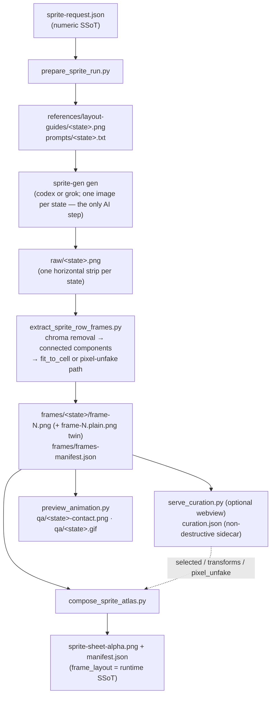
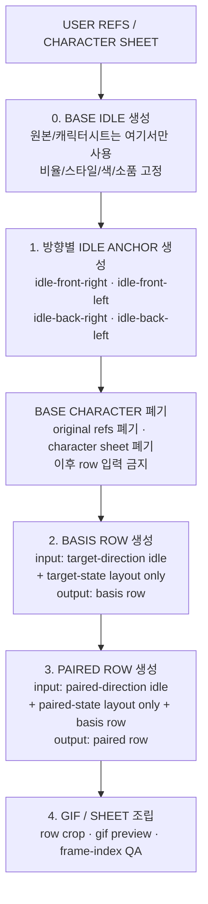

# sprite-gen — Implemented Architecture

> Status: reference (describes the code as it actually is, v1.56.x, 2026-07-11).
> Canonical behavior contract lives in [`../SKILL.md`](../SKILL.md); this doc
> explains *how* the scripts realize that contract. If this doc and `SKILL.md`
> ever disagree, `SKILL.md` wins and this doc is the bug.

## 1. One sentence

A character image plus a numeric request becomes a transparent sprite atlas by
generating **one horizontal strip per animation state**, cleaning chroma,
extracting poses as connected components, refitting each pose into a fixed cell
(optionally through the deterministic pixel-unfake path), and packing the
cells into a single sheet described by a runtime manifest.



## 2. Stage ownership (each script does one job)

The canonical stage → script → input → output table is owned by
[`run-contract.md`](run-contract.md) §1. This section explains the shared-import
and locking behavior *behind* that table.

The scripts are explicit pipeline commands, not hidden imports. The shared
imports are `curation.py` (schema + transform math + the `frame_variant`/
`frame_filename` resolver, kept single-source so the webview server and the
compose scripts cannot drift) and `runio.py` (safe run-dir IO: a single-writer
lock file `.sprite-gen.lock` taken by the extract/compose/export/unpack
writers, plus atomic temp+`os.replace` writes for frames, atlas, manifests, and
inspect/score/loop reports). The lock enforces the "one worker owns one
character folder" rule at runtime — a second writer on the same run dir fails
loudly with the holder's pid; a dead holder's lock is reclaimed automatically.
`curation.json` stays outside the pipeline write lock: the webview writes it
atomically and compose reads one consistent snapshot, so human edit sessions never
block on a running compose. The curation write is, however, serialized against a
`--force` re-import publish via the separate publish rwlock (`read_guard`/
`publish_guard`), and a curation POST whose echoed run generation (`runRevision`)
no longer matches is rejected — a stale autosave cannot apply old selections to a
re-imported run's frames, even when it keeps the same state names (run-contract.md §4).

`compose_layers.py` (the optional composite bake) is another consumer of those same
shared primitives: it resolves a curated instance exactly as `compose_atlas` does and
then stacks instances by integer translation, so a composite is a combination of what
the atlas bakes rather than a second extraction path. Its declaration half,
`layers.py`, is filesystem-free on purpose — the request is validated before a run dir
is touched, and every entry point calls that one validator (`layer-tracks.md` §6):
`prepare` when it carries the declared layer keys into `sprite-request.json`,
`compose_atlas` before it publishes a rig block, and `compose_layers` before it bakes.
The bake publishes its sheets, manifests and report through a single
`runio.atomic_write_set`, so the set that only means anything together lands together.

The automatic correction loop is intentionally split into three owners:
`inspect.py` measures deterministic signals (frame count, RGB histogram, dHash,
motion presence, centroid jitter, existing extraction warnings), `score.py`
turns only that report into scores and correction hints, and
`correction_loop.py` preserves the best candidate while optionally invoking an
explicit provider command. In dry-run mode it never generates new pixels; it
only proves the defect → score → hint path.

## 3. The numeric SSoT: `sprite-request.json`

Every run starts here. It owns the recipe consumed by both prompts and scripts:

```json
{
  "version": 1,
  "kind": "sprite-gen-request",
  "engine": "component-row",
  "character": { "id": "demo-hero", "description": "...", "base_image": "base-source.png" },
  "cell": { "shape": "square", "size": 256, "safe_margin": 24 },
  "chroma_key": { "name": "magenta", "hex": "#FF00FF", "rgb": [255, 0, 255] },
  "chroma": { "mode": "rgb" },
  "states": { "idle": { "frames": 4, "fps": 4, "loop": true, "action": "..." } },
  "fit": { "pixel_unfake": true, "logical_height": 64, "palette_size": 24, "align_x": "foot-centroid", "align_y": "bottom", "segmentation": "components" },
  "style": "...",
  "motion_phase_guides": false
}
```

- `character.base_image` is the canonical identity source for the *pre-idle*
  phase only (see §5).
- `chroma_key` is chosen by sampling the base image (`--chroma-key auto`) unless
  forced. The key is picked **away from the subject's dominant hue** because
  extraction eats chroma-adjacent tint (behavior contract:
  [`chroma-alpha.md`](chroma-alpha.md)).
- `states` is a free map; `frames`/`fps`/`loop`/`action` per state.
- `fit` is optional (absent = legacy behavior): `resample`/`align_x`/`align_y`
  tuning, or the full deterministic `pixel_unfake` mode (§6.1). Behavior
  contract: [`pixel-unfake.md`](pixel-unfake.md).
- `fit.segmentation` is `components` by default; opt-in `projection` is the
  fused-pose recovery path (§6). The extract CLI can explicitly override it.
- `chroma.mode` is `rgb` by default; opt-in `ycbcr` is owned by
  [`chroma-alpha.md`](chroma-alpha.md). The extract and inspect CLIs can
  explicitly override it.
- `motion_phase_guides` only does something for 8-frame locomotion states.

## 4. The cell model (read this — it is the most misunderstood part)

There is exactly **one** `cell` object, and it drives **all three** geometry
stages identically:

1. **Generation** — `draw_guide()` renders a guide of `frames * cell_width`
   wide × `cell_height` tall, and `row_prompt()` tells the model to treat the
   strip as "invisible `cell_width`×`cell_height` frame slots".
2. **Extraction** — `fit_to_cell()` refits each extracted pose into a
   `cell_width`×`cell_height` transparent cell.
3. **Atlas** — `compose_sprite_atlas.py` places every frame into a
   `cell_width`×`cell_height` slot; the sheet is
   `max_frames*cell_width` × `num_states*cell_height`.

### 4.1 Square vs rect — variabilized, but a single shape

`size` is a variable, not a hidden constant. The cell may be square or rect:

```json
"cell": { "shape": "square", "size": 256, "safe_margin": 24 }
"cell": { "shape": "rect", "width": 192, "height": 208, "safe_margin_x": 18, "safe_margin_y": 16 }
```

`normalize_cell()` derives `shape` from `width == height`. **Default is square
256.** Picking `rect` makes the cell taller (hatch-pet-style) — but that one
shape is then used end-to-end, generation *and* output alike.

### 4.2 Design note: one cell, NOT a two-stage tall→square transform

A common mental model is "generate in a tall/portrait cell to save image area,
then cut/place into a square cell for the final atlas." **The code does not do
this.** There is no separate `gen_cell` vs `atlas_cell`; the generated strip and
the final atlas share the same `cell`. If you generate rect, the atlas is rect;
if you generate square, the atlas is square.

What *is* true, and what makes a two-stage model only a small step away:
extraction is **content-based, not slot-based**. `connected_components()` finds
each pose blob, groups blobs by x-center, and `fit_to_cell()` crops the content
bbox, rescales it preserving aspect ratio (`scale = min(...) ≤ 1.0`), and
centers it in the target cell. So the refit already decouples a pose from the
strip's pixel dimensions — a future change could feed a tall `gen_cell` to the
guide/prompt and a square `atlas_cell` to `fit_to_cell`/compose without touching
the extraction core. Today, that separation is not wired.

## 5. Idle-anchor architecture (identity ownership)

Stage 0 is a BLOCKING gate (the gate question and the five lock criteria live
in [`../SKILL.md`](../SKILL.md)). The ownership rule:

```text
identity truth = accepted idle anchor
motion truth   = layout guide + paired/basis row when needed
base truth     = used only to create idle anchors, then dropped from row inputs
```

Base character images, original character sheets, and broad style references
are allowed **only** before idle anchors are accepted. Once an idle anchor
exists for the requested direction, later state rows must not attach the base
character image as insurance. Re-attaching base makes the row model solve
identity again and weakens the purpose of the idle-anchor workflow.

Reference ownership flow:



- The prompt text in `row_prompt()` enforces this ("Anchor lock" block):
  identity comes from the anchor, the row owns motion only.
- **Which image is "the accepted anchor" is code, not judgment** (`sprite_gen/curate/anchor.py`,
  `sprite-gen anchor`): it resolves the human's pin (`curation.json` `anchors.<direction>`)
  or, absent one, the anchor row's curated sequence head; bakes that instance with the
  same primitives compose/export use (clone → pixel edits → transform → pixel-unfake
  re-quantization); and writes the derived cache
  `references/anchors/<dir>-anchor-x8.png` that row generation attaches. Reroll, the
  generation plan, and the curation view's anchor chip all go through it, so the picture
  the human approved on screen is the picture the next row inherits.
- Default/simple states (`idle`/`jump`/`attack`/`wave`) skip the multi-anchor
  chain. Directional / 45° / locomotion use the chain documented in
  [`directional-anchor-workflow.md`](directional-anchor-workflow.md).

## 6. Extraction internals (`extract_sprite_row_frames.py`)

1. `remove_chroma_background()` — drop near-key pixels (color-distance ball,
   `--key-threshold` default 96), clear fully-transparent RGB, then solve
   chroma-tinted boundary blends into despilled RGB + soft alpha. In-band
   blends are limited to key-distance `<= 2`; out-of-band blends use
   `--fringe-unmix-reach` (default 4). Small trapped spill clusters are
   despilled in place, while deeper key-tinted subject material survives.
   With request `chroma.mode: "ycbcr"` or CLI `--chroma-mode ycbcr`, the
   extractor uses `remove_chroma_background_ycbcr()` instead: border-mode key
   detection and chrominance-plane flood fill tolerate shaded keys and JPEG
   chroma noise. RGB remains the default.
2. `connected_components()` — flood-fill alpha blobs, record bbox + area +
   x-center.
3. `separate_fused_poses()` — only when `fit.segmentation: "projection"` or
   `--segmentation projection` is selected, projection profiles plus dynamic
   programming find the minimum-cost vertical cuts for poses joined by thin
   bridges. The default `components` path stays byte-identical and fails
   loudly when the declared pose count cannot be recovered.
4. `extract_component_frames()` — pick `frame_count` seed blobs by area, sort by
   x-center, attach smaller noise blobs to the nearest seed; one group = one
   pose. If it cannot find `frame_count` poses, the row is **blocked** (no
   silent fallback). `--allow-slot-fallback` exists for debugging only and is
   reported as `method: slots-explicit`.
5. `fit_to_cell()` — crop, aspect-preserving downscale (`resample`:
   lanczos | nearest | kcentroid), `align_x`/`align_y` placement, into the
   cell. On `fit.pixel_unfake` runs this legacy path still runs once per
   frame to produce the `.plain.png` twin (§6.1); the canonical frame goes
   through the pixel-unfake path instead.
6. `inspect_frames()` — per-frame QA: empty/sparse, edge bleed, chroma-adjacent
   pixels, size outliers → `frames-manifest.json`.

This is intentionally closer to hatch-pet's cleanup than to a plain
`magick -transparent`.

### 6.1 Pixel-unfake path (`fit.pixel_unfake`, deterministic)

The behavior contract is [`pixel-unfake.md`](pixel-unfake.md); this is how
the code realizes it. The path is unfake.js/pixeldetector-style and contains
**no model call and no non-integer resampling** — same input, same output:

1. **Pitch detection** — `detect_pixel_pitch()` scores each candidate pitch by
   edge-to-gridline alignment (the fraction of color boundaries landing within
   ±w of grid lines, minus the chance expectation `(2w+1)/p`) and takes the
   argmax. Detection runs **per frame** and **each frame is snapped with its
   own detected pitch** (maintainer 2026-07-20, plan `sprite-gen/per-frame-pixel-grid`:
   forcing a strip-wide pitch onto a frame accumulates the measurement gap
   across the width and cuts through block centers). The **median** across
   confident frames (collapse-filtered) is kept only as the fallback for frames
   whose own detection is inconclusive — applying it emits a per-frame warning,
   and a frame whose own pitch deviates from the consensus is warned, never
   overridden. If every frame fails, `fit.pitch_hint` (usually the base
   image's detected pitch) is used. `estimate_pixel_grid_runlen()` then
   derives an independent modal run-length estimate; `crosscheck_pitch_runlen()`
   records divisor/harmonic or axis-ratio disagreement as observable warnings.
   The run-length estimate is a crosscheck only and never silently replaces the
   canonical grid score.
2. **Grid-phase snap** — the phase is **measured, not inferred from the pitch
   detector**: `_best_phase()` scores real cell uniformity per frame and picks
   the best offset, `refine_edges_to_boundaries()` then pulls each interior cut
   onto a real colour boundary (±pitch/3), and `snap_by_edges()` collapses each
   block to one output pixel via `_dominant_block_color()` voting. The
   histogram phase that `_axis_refine()` returns alongside the pitch is **not**
   used here — it can sit up to pitch/2 off the true phase, which is outside the
   ±pitch/3 recovery window and merged a character's eye from 4 rows into 3
   (plan `sprite-gen/frame-pitch-consensus-eats-a-row`; see
   [`pixel-unfake.md`](pixel-unfake.md) "위상은 근사가 아니라 실측으로 고른다").
   `detail_bias` (default true) prefers a near-black minority cluster
   (share ≥ 0.40, luma < 70/255) so eyes and 1px outlines survive dominant voting.
3. **Physical cap only — no conform squash** — `conform_row_logical()` keeps the
   snapped native logical size and only enforces the physical cell cap
   (kCentroid, `_kcentroid_downscale()`), warning observably when a frame hits
   it. Squashing to a declared `logical_height` was removed (maintainer
   2026-07-14/17: it merges cells and eats detail); `fit.conform` is now
   rejected loudly if present in a request.
4. **Alpha binarization** — `binarize_alpha()`, applied on the outputs of steps
   2-3 (snap, then cap) so every logical pixel is fully opaque or fully
   transparent.
5. **Inter-frame registration** — `register_row_frames()` aligns frames on the
   stable upper body (alpha overlap, small slack), so locomotion rows don't
   jitter on per-frame content changes.
6. **Shared palette** — `build_shared_palette()` + `apply_palette()`: one
   run-wide median-cut palette (`palette_size`) kills frame-to-frame color
   flicker.
7. **Outline** — `enforce_outline()` draws a uniform 1px silhouette outline.
8. **Integer placement** — `fit_pixel_unfake()` / `row_placement()` upscale by
   the integer factor `cell_height // logical_height` (NEAREST) and place with
   offsets honoring `align_x`/`align_y`. `align_x: "alpha-centroid"` computes
   the fringe-insensitive alpha-weighted centroid per frame (alpha ≤ 10 is
   ignored), cancelling residual horizontal registration jitter without
   flattening vertical motion arcs.

Alongside each canonical `frame-N.png`, the extractor writes two pre-pixel-
perfect twins (same strip through the legacy fit path; if twin production fails
it is a warning, only that twin is dropped): the cell-sized `frame-N.plain.png`
and the hi-res `orig/frame-N.png` (legacy fit at S×cell, `S = min(4, 1024//cell)`,
display-only). The curation webview toggles the display to `orig/` when present
(crisp "off = original", else `.plain.png`), while `curation.json.pixel_unfake:
false` makes compose/GIF/PNG export bake the cell-sized `.plain.png` variant —
missing plain files are a hard error, not a silent fallback. The hi-res twin
lives in a subdir so non-recursive `frame-*.png` globs (inspect, measure) never
pick it up. The chosen variant is recorded as `frame_variant` in reports and the
manifest. Display-contract SSoT: [`run-contract.md`](run-contract.md) §3.

## 7. Curation sidecar (`curation.json`)

Optional, **non-destructive**. Written by the webview (`serve_curation.py`),
consumed by `compose_sprite_atlas.py` and `compose_selected_cycle.py`. The
original `frames/<state>/frame-N.png` files are never rewritten.

```json
{ "version": 1, "kind": "sprite-gen-curation", "run_revision": "9f3c1a0b7e2d4c58",
  "pixel_unfake": true,
  "states": { "idle": { "selected": [0,2,3], "order": [0,2,3,1],
    "transforms": { "0": { "rotate": 15, "scale": 1.2, "dx": 10, "dy": -8, "flipX": 0 } } } } }
```

- `run_revision` — **required** frame-generation stamp. `load_curation` applies the
  sidecar only when it matches the current run; a mismatched **or missing** stamp is
  stale and ignored (all-frames default, stderr-warned) — a re-import/re-extract or a
  legacy/hand-written sidecar never applies to frames it isn't proven to belong to.
- `pixel_unfake` — top-level bake decision: `false` → compose/export bake the
  `.plain.png` twins (§6.1); absent/`true` → canonical `frame-N.png`.
- `selected` — 0-based indices in play order; absent → all frames in order.
- `order` — webview-owned full display order (sequence row then candidate-pool
  row) so reopening the curator restores both rows; compose ignores it and
  keys off `selected`.
- `transforms` — per-index affine (`rotate`, `scale`, `dx`/`dy`, `shx`/`shy`
  shear, `flipX`), applied at compose time **inside** the cell so atlas
  geometry never changes.
- A state missing from the sidecar uses the all-frames identity default — an
  explicit default, not a silent fallback.
- `curation.py` owns the schema + transform math (single source for server and
  compose). Full field semantics: [`curation.md`](curation.md).

## 8. Runtime contract (`manifest.json`)

`manifest.json.frame_layout` is the runtime SSoT. Game code consumes absolute
rectangles and must not recover frame rects from alpha at runtime.

Required fields:

- `game_input: "sprite-sheet-alpha.png"`
- `degraded_static_fallback: false`
- `animation.rows.<state>` → `{ row, frames, fps, loop }`
- `frame_layout.rows.<state>[i]` → `{ x, y, w, h }` absolute atlas rects
- `frame_layout` also carries `sheetWidth/sheetHeight/cellWidth/cellHeight`
- `curation_applied` records whether a sidecar was baked; `frame_variant`
  records which frame variant (canonical / plain) was baked
- **rig runs only** (`sprite_gen/compose/layers.py`, `compose_layers.py`): `rig.profile` +
  `rig.landmarks.<state>[i]` — atlas-absolute integer pivots indexed by play
  position, so they zip 1:1 against `frame_layout.rows.<state>` — and
  `animation.rows.<state>.track`. A run that declares no rig produces exactly the
  key set above; `layer-tracks.md` §1 owns that boundary

Static fallback is allowed only as explicit survival output when generation is
blocked; it must not create `sprite-sheet-alpha.png` and is not a pass.

## 9. Output directory (one worker owns one character folder)

The canonical run-dir folder tree (every input/output file, plus which files drive
the curation view) is owned by [`run-contract.md`](run-contract.md) §2. The
single-writer lock that enforces "one worker owns one character folder" at runtime is
`runio.py`'s `.sprite-gen.lock` (§2 above).

## 10. Inverse paths (editing finished assets)

- `unpack_atlas_run.py` rebuilds a curator-ready run dir from a finished atlas
  (layout source priority: `--grid` > `--manifest` > auto-detect), or imports a
  folder of separate PNGs via `--pngs-dir` (carries a sibling `meta.json` for
  iso tile/anchor grid overlay).
- `export_curated_pngs.py` bakes the curation transform back into named PNGs
  (the deliverable for imported still sets like furniture); the single atlas is
  the deliverable for animation frames / runtime perf.

## 11. Relationship to hatch-pet

`sprite-gen` is inspired by the Apache-2.0 `hatch-pet` skill but ships no pet
assets. Shared DNA: one image-gen job **per row/state**, layout-guide grounding,
chroma cleanup, deterministic assembly scripts, contact-sheet/video QA.

Key differences:

| | hatch-pet | sprite-gen |
|---|---|---|
| Atlas | fixed 8×9, fixed 192×208 cell, 9 fixed pet states | variable state list, variable cell (square default 256) |
| Cell shape | fixed rect 192×208 | square or rect, one config end-to-end (§4) |
| Frame cut | slot-based geometry | content-based connected components + refit (+ pixel-unfake path) |
| Identity | canonical base reference reused on every row | idle-anchor ownership; base dropped after anchors |
| Curation | n/a | non-destructive `curation.json` + webview |
| Inverse | n/a | unpack atlas / import PNG pack / export stills |
| Packaging | `pet.json` + `spritesheet.webp` into `~/.codex/pets/` | runtime `manifest.json` `frame_layout` |

Both generate **row-by-row, one state per image-gen call** — neither produces a
whole atlas in a single generation.

## Related

- [`../SKILL.md`](../SKILL.md) — canonical behavior contract
- [`pixel-unfake.md`](pixel-unfake.md) — `fit`/`pixel_unfake` behavior contract
- [`curation.md`](curation.md) — webview usage + `curation.json` field semantics
- [`chroma-alpha.md`](chroma-alpha.md) — chroma key selection + alpha cleanup contract
- [`gen.md`](gen.md) — provider CLI, verified PNG/report contract, and `image-gen` shuttle boundary
- [`layer-tracks.md`](layer-tracks.md) — optional rig profiles, row track kinds, deterministic composite stacks
- [`directional-anchor-workflow.md`](directional-anchor-workflow.md) — 방향성/45도 앵커 체인
- [`locomotion-curation.md`](locomotion-curation.md) — selected-cycle + clean GIF export
