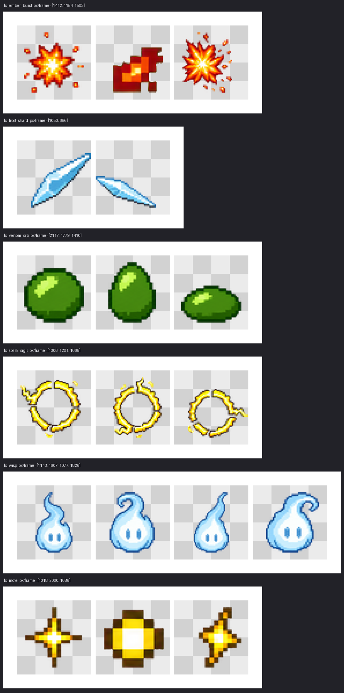

# Subject profiles - character vs effect

The sparse-frame floor (`--min-used-pixels`) catches empty frames and extraction debris. The right floor depends on what a run draws and on its cell geometry. A character normally fills more of its cell than a spell spark, while users may choose any resolution, so neither profile owns one absolute pixel constant.

```jsonc
// sprite-request.json
{ "subject": "effect" }   // omit the field for the default character profile
```

```bash
sprite-gen prepare --subject effect ...
```

```text
equivalent_side = ceil(sqrt(cell_width * cell_height))

character floor = equivalent_side
effect floor    = ceil(equivalent_side / 2)
```

The geometric mean gives rectangular cells one equivalent side without making either axis canonical. Scaling both axes by `k` scales the floor by `k`, not `k^2`: this guard protects a minimum readable linear footprint instead of imposing one coverage percentage at every resolution. Safe margins are excluded because integer margin rounding could make the floor decrease when a cell grows.

| cell | character | effect |
|---|---:|---:|
| 16x16 | 16 | 8 |
| 32x32 | 32 | 16 |
| 64x64 | 64 | 32 |
| 128x128 | 128 | 64 |
| 256x256 | 256 | 128 |
| 192x208 | 200 | 100 |

An explicit `--min-used-pixels` always wins. Explicit values are stamped into `extract_args` so heal reproduces them exactly. Profile-derived values are not stamped because frames are a cache of raw input, request, and engine; changing `subject` must re-resolve the formula on heal.

## Synthetic boundary battery

The repository verifies the profile with generated solid-shape strips rather than private production data.

| opaque px/frame at 64x64 | character | effect |
|---|---|---|
| 16 | fail | fail |
| about 36 | fail | pass |
| 64 and above | pass | pass |

The same tests sweep every square cell size from 16 through 512, rectangular cells, monotonic growth on either axis, unknown subject rejection, explicit overrides, heal behavior, and compose behavior.

## End-to-end public gallery

These public examples were generated through `prepare --subject effect`, `gen`, `extract`, and `compose-atlas` without a floor override.

<p align="center">
  
  
  
  
</p>



## Practices

- Declare `subject` in the request. The request is the run's SSoT and travels with heal, curation, and later maintainers.
- Read `frames-manifest.json` whenever extraction reports `ok: false`; it records each rejected frame and measured count.
- Use `--min-used-pixels` only for a deliberate outlier below the derived profile floor.
- Keep chroma-key hues far from wispy or translucent effect colors so unmixing does not erase the subject into the debris band.
- Do not lower a global floor for every run. That would disable the debris guard for unrelated subjects.
